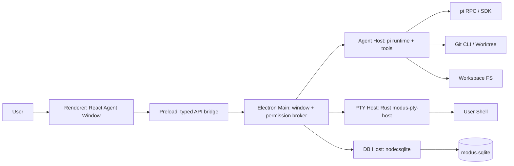

# Modus V0.1.0 执行方案

状态：V0.1.0 MVP 已落地  
日期：2026-06-01  
定位：开源、本地优先的 Cursor 3.0 Agent Window 替代品  
第一阶段目标：先落地桌面端应用，预留 Web 官网技术栈位置  

## 0. 调研约束与证据基线

本方案基于 2026-06 前后的实时资料检索。设计中涉及的外部依赖、框架和第三方 API 均以官方文档、源码或主仓库资料为准。

已复核的关键资料：

- Cursor Agent Window 官方文档：[Agents Window](https://cursor.com/cn/docs/agent/agents-window)、[Agent Overview](https://cursor.com/cn/docs/agent/overview)、[Prompting](https://cursor.com/cn/docs/agent/prompting)、[Plan Mode](https://cursor.com/cn/docs/agent/plan-mode)、[Debug Mode](https://cursor.com/cn/docs/agent/debug-mode)、[Agent Review](https://cursor.com/cn/docs/agent/agent-review)、[Rules](https://cursor.com/cn/docs/rules)、[Skills](https://cursor.com/cn/docs/skills)、[Subagents](https://cursor.com/cn/docs/subagents)、[MCP](https://cursor.com/cn/docs/mcp)、[Worktrees](https://cursor.com/cn/docs/configuration/worktrees)。
- Electron 官方文档：[Security](https://electronjs.org/docs/latest/tutorial/security)、[Performance](https://electronjs.org/docs/latest/tutorial/performance)、[IPC](https://electronjs.org/docs/latest/tutorial/ipc)、[Context Isolation](https://electronjs.org/docs/latest/tutorial/context-isolation)、[utilityProcess](https://electronjs.org/docs/latest/api/utility-process)、[Native Node Modules](https://electronjs.org/docs/latest/tutorial/using-native-node-modules)。
- Electron release 资料：Electron 42 于 2026-05 发布，包含 Chromium 148、Node 24.15.0、V8 14.8；2026-05-26 看到 `42.3.0` stable，`43.0.0-alpha` 仍为 alpha。来源：[Electron 42](https://electronjs.org/blog/electron-42-0)、[Electron Releases](https://releases.electronjs.org/)。
- 构建与打包：[electron-vite](https://electron-vite.org/guide)、[electron-builder](https://www.electron.build/)。
- UI 与前端：[React](https://react.dev/)、[Vite](https://vite.dev/guide/)、[Tailwind CSS Vite install](https://tailwindcss.com/docs/installation/using-vite)、[Radix Primitives](https://www.radix-ui.com/primitives/docs/overview/introduction)、[shadcn/ui](https://ui.shadcn.com/docs)。
- 编辑器与终端：[Monaco Editor](https://microsoft.github.io/monaco-editor/)、[monaco-editor GitHub](https://github.com/microsoft/monaco-editor)、[xterm.js docs](https://xtermjs.org/docs/)、[portable-pty](https://docs.rs/portable-pty/latest/portable_pty/)。
- 本地数据库：[Node.js `node:sqlite`](https://nodejs.org/docs/latest-v24.x/api/sqlite.html)、[Drizzle ORM docs](https://orm.drizzle.team/)。
- Agent runtime：[pi docs](https://pi.dev/docs/latest)、[pi usage](https://pi.dev/docs/latest/usage)、[pi RPC](https://pi.dev/docs/latest/rpc)、[pi JSON mode](https://pi.dev/docs/latest/json)、[pi session format](https://pi.dev/docs/latest/session-format)、[pi GitHub](https://github.com/earendil-works/pi)。
- `pi` 最新状态：GitHub CLI 确认 `earendil-works/pi` 最新 release 为 `v0.78.0`，发布时间 `2026-05-29T23:49:12Z`。源码核心目录包含 `agent-session-runtime.ts`、`agent-session.ts`、`session-manager.ts`、`bash-executor.ts`、`tools/` 等 Agent Host 可集成模块。
- 竞品技术栈证据：OpenCode Desktop 从 Tauri 转 Electron 的公开说明：[Moving OpenCode Desktop to Electron](https://dev.to/brendonovich/moving-opencode-desktop-to-electron-4hip)。OpenCode 当前 PTY 层使用 `bun-pty`；Warp 官方资料显示其终端核心采用 Rust 原生架构并深度处理 PTY/ConPTY。Modus V0.1.0 因此从 `node-pty` 调整为 Rust `modus-pty-host` sidecar。

## Implementation Snapshot

截至 2026-06-01，V0.1.0 已完成 M0-M8 的 MVP 落地：

- 桌面端：Electron 42 + electron-vite + React 19 + Tailwind v4 已可启动。
- 安全边界：`contextIsolation=true`、`nodeIntegration=false`、`sandbox=true`、typed preload IPC、sender validation 已实现。
- 本地 workspace：directory picker、recent workspaces、Git repo detection、SQLite persistence 已实现。
- Agent runtime：`pi --mode rpc` adapter、JSONL parser、prompt/abort、stdout/stderr/exit/error event mapping 已实现 MVP。
- Terminal：已从 `node-pty` 改为 Rust `modus-pty-host` sidecar，基于 `portable-pty` 使用系统 PTY/ConPTY/openpty。
- Diff：Git changed file scanner、Monaco diff view、revert IPC 已实现 MVP。
- Permission：permission decision schema、SQLite persistence、IPC surface 已实现 MVP。
- Worktree：Git worktree list/create/delete IPC 已实现 MVP。
- Packaging：Windows NSIS installer smoke 已通过，unpacked resources 中确认包含 `resources/bin/modus-pty-host.exe`。

最新验证：

- `cargo check -p modus-pty-host` 通过。
- `cargo build --release -p modus-pty-host` 通过。
- `npm run check` 通过。
- `npm --workspace @modus/desktop run build` 通过。
- `npm --workspace @modus/desktop run package:win -- --publish never` 通过。

## 1. 产品定义

Modus V0.1.0 不是 VS Code fork，也不是通用 IDE。它的第一版是：

> Local-first Agent Window powered by pi.

也就是：

- 用一个桌面端窗口管理本地仓库、本地 Agent 会话、本地终端、本地文件变更。
- 以 `pi` 作为 Agent Runtime，Modus 负责 Agent Window、上下文选择、会话可视化、权限、安全、diff、worktree 和桌面产品体验。
- 先不做云端 agents、移动端协作、Slack/Linear/GitHub bot、企业管理后台。
- 预留 Web 官网技术栈位置，但 V0.1.0 不建设 Web SaaS 后端。

V0.1.0 的验收标准：

1. 用户可以打开 Modus 桌面端并选择一个本地 repo。
2. 用户可以创建一个由 `pi` 驱动的本地 agent session。
3. 用户可以在 Agent Window 中看到消息流、工具调用流、终端输出和 agent 状态。
4. 用户可以通过 `@` 添加文件、目录、Git diff、终端输出等上下文。
5. Agent 可以读取/编辑工作区文件，所有文件变更进入 diff 面板。
6. 终端命令、敏感文件写入、MCP 调用等危险操作必须经过权限 broker。
7. 用户可以查看、接受、撤销变更。
8. 用户可以在本地 worktree 中启动隔离 agent 任务。

## 2. 范围控制

### 2.1 V0.1.0 必做

- Electron 桌面壳。
- Agent Window 三栏布局：
  - 左侧：Workspace / Session 列表。
  - 中间：Agent conversation timeline。
  - 右侧：Diff / Files / Terminal / Context inspector。
- `pi` runtime 集成：
  - 优先支持 `pi --mode rpc` 子进程集成。
  - 预留 `@earendil-works/pi-coding-agent` SDK 直连集成。
- 本地 session 持久化：
  - 读取 `pi` JSONL session。
  - Modus 自身 SQLite 存 metadata、workspace、agent task、permission decisions、UI state。
- 上下文选择：
  - `@file`
  - `@folder`
  - `@git-diff`
  - `@terminal`
  - `@session`
- 工具调用可视化：
  - read / grep / find / ls
  - edit / write
  - bash
- 终端：
  - xterm.js renderer UI。
  - Rust `modus-pty-host` sidecar backend。
- Diff：
  - Monaco Diff Editor。
  - 文件级 changed list。
  - 支持 revert 单文件到 checkpoint。
- 权限：
  - shell command ask/allow/deny。
  - sensitive path guard。
  - MCP call ask/allow/deny，V0.1.0 可只实现框架，不接完整 MCP server marketplace。
- Worktree：
  - `git worktree add` 创建隔离 checkout。
  - worktree task 与 session 绑定。
  - basic cleanup。
- 开发工程：
  - TypeScript strict。
  - Biome formatter/linter。
  - Vitest unit tests。
  - Playwright smoke tests。
  - electron-builder 三平台打包配置占位。

### 2.2 V0.1.0 明确不做

- 不 fork Code OSS。
- 不做完整 VS Code extension API。
- 不做云端 Agent。
- 不做账户系统、团队系统、计费系统。
- 不做移动端、Slack、Linear、GitHub bot。
- 不做完整浏览器自动化。
- 不做完整 Plan/Debug/Review 模式的自动化能力，只做 UI/数据模型预留。
- 不做 MCP Marketplace，只做本地 MCP 配置和权限模型预留。
- 不做代码索引服务的最终形态。V0.1.0 可以先用文件搜索和 `pi` 工具，后续再引入代码图谱/语义索引。

## 3. 技术栈定稿

### 3.1 桌面端

| 层 | 技术 | 决策 |
| --- | --- | --- |
| Desktop runtime | Electron 42.x stable | 采用 stable，不追 `43 alpha` |
| Build | electron-vite | 三入口：main / preload / renderer |
| Packaging | electron-builder | dmg / nsis / AppImage / deb |
| Language | TypeScript | strict，ESM 优先，preload 按 Electron 约束单独处理 |
| UI | React 19 | renderer-only |
| Bundler | Vite latest stable | 满足 Node 要求 |
| Styling | Tailwind CSS v4 + `@tailwindcss/vite` | 零运行时 CSS |
| Components | Radix Primitives + shadcn/ui open-code | accessibility + 可控源码 |
| Editor/Diff | Monaco Editor | code viewer、diff viewer、prompt editor 可后续复用 |
| Terminal UI | xterm.js | renderer 只做 terminal view |
| PTY | Rust `modus-pty-host` + `portable-pty` | sidecar 负责系统 PTY/ConPTY/openpty，renderer 只接收事件 |
| DB | SQLite + Node `node:sqlite` | main/db-host 内使用，WAL，避免 native addon ABI 风险 |
| ORM | Drizzle ORM | schema 类型化，迁移可先 custom SQL runner |
| Agent runtime | pi v0.78.x | 先 RPC，预留 SDK |
| Test | Vitest + Playwright | unit + desktop smoke |
| Lint/format | Biome | 快速统一 TS/JS/JSON/CSS |

### 3.2 Web 官网预留

V0.1.0 不实现官网，但保留 `apps/web` 目录和技术位置：

| 层 | 技术 | V0.1.0 状态 |
| --- | --- | --- |
| Website | Astro 或 VitePress | 预留，暂不实现 |
| Docs | Markdown / MDX | 预留 |
| Landing UI | React + Tailwind v4 | 与 desktop 共享 design tokens |
| Deploy | Cloudflare Pages / Vercel | 后续选择 |

官网只承担：

- 产品介绍。
- 下载链接。
- 文档。
- 开源贡献指南。

不承担：

- 账户。
- 云同步。
- Agent 托管。
- 计费。

## 4. 架构总览



核心边界：

- Renderer 只能调用 preload 暴露的 typed API。
- Preload 不能暴露原始 `ipcRenderer`。
- Main 是权限和生命周期中枢，但不能做重 CPU/IO 工作。
- Agent Host 是 agent 运行时和工具调用的边界。
- DB Host 是同步 SQLite 的边界。
- PTY Host 是 shell 生命周期边界。

## 5. Electron 安全基线

按 Electron 官方安全文档执行：

- `nodeIntegration: false`
- `contextIsolation: true`
- `sandbox: true`
- 禁止 `webSecurity: false`
- 禁止加载远程代码。
- 禁止将 `ipcRenderer` 原样暴露给 renderer。
- 所有 IPC handler 必须验证 sender。
- 所有 IPC payload 必须用 Zod 校验。
- 使用自定义协议加载本地资源，避免随意使用 `file://`。
- 外链只能通过受控 `openExternal`，且 URL 必须验证。

V0.1.0 的 preload API 形态：

```ts
type ModusApi = {
  workspace: {
    openDirectory(): Promise<WorkspaceInfo>;
    listRecent(): Promise<WorkspaceInfo[]>;
  };
  agent: {
    create(input: CreateAgentInput): Promise<AgentSessionInfo>;
    prompt(input: PromptInput): Promise<void>;
    abort(sessionId: string): Promise<void>;
    subscribe(sessionId: string, listener: AgentEventListener): Unsubscribe;
  };
  terminal: {
    create(input: CreateTerminalInput): Promise<TerminalInfo>;
    write(input: TerminalWriteInput): Promise<void>;
    resize(input: TerminalResizeInput): Promise<void>;
    subscribe(terminalId: string, listener: TerminalEventListener): Unsubscribe;
  };
  diff: {
    list(sessionId: string): Promise<FileChange[]>;
    read(changeId: string): Promise<FileDiff>;
    revert(changeId: string): Promise<void>;
  };
  permission: {
    decide(input: PermissionDecision): Promise<void>;
  };
};
```

注意：这是设计形态，不是直接实现代码。实现时必须按 Electron IPC 文档使用 `contextBridge`、`ipcMain.handle`、`ipcRenderer.invoke` 和 sender 校验。

## 6. `pi` 集成方案

### 6.1 为什么用 `pi`

`pi` 官方定位是 minimal terminal coding harness，具有：

- coding agent CLI。
- unified LLM provider。
- agent core。
- session tree。
- compaction。
- JSON event stream。
- RPC mode。
- SDK。
- tools：read / bash / edit / write / grep / find / ls。

`pi` 文档明确说明它不内置 MCP、subagents、permission popups、plan mode、background bash。这正好形成 Modus 的产品价值：`pi` 负责 agent loop，Modus 负责桌面产品层和安全/协作/可视化。

### 6.2 V0.1.0 集成路径

优先级：

1. **RPC 子进程模式**
   - 启动：`pi --mode rpc --session-dir <modus-session-dir> --name <task-name>`
   - 通信：stdin/stdout JSONL。
   - 优点：进程隔离，崩溃不拖垮桌面。
   - 风险：需要处理 stdout backpressure、进程重启、协议版本。

2. **SDK 直连模式，V0.2+**
   - 使用 `@earendil-works/pi-coding-agent` 的 `createAgentSessionRuntime()`、`AgentSession`、`SessionManager`。
   - 优点：更深集成。
   - 风险：Electron bundle / native dependency / process lifecycle 更复杂。

V0.1.0 先实现 RPC adapter，并把 SDK adapter 做接口预留。

```ts
interface AgentRuntimeAdapter {
  start(input: StartAgentInput): Promise<RuntimeSession>;
  prompt(sessionId: string, input: PromptInput): Promise<void>;
  abort(sessionId: string): Promise<void>;
  dispose(sessionId: string): Promise<void>;
  onEvent(sessionId: string, listener: (event: AgentRuntimeEvent) => void): Unsubscribe;
}
```

### 6.3 `pi` event 到 Modus event 映射

| pi event | Modus event | UI |
| --- | --- | --- |
| `agent_start` | `agent.started` | session status running |
| `message_update` | `message.delta` | streaming assistant text/thinking |
| `tool_execution_start` | `tool.started` | tool card pending |
| `tool_execution_update` | `tool.output` | terminal-like stream |
| `tool_execution_end` | `tool.ended` | success/error card |
| `queue_update` | `queue.updated` | queued messages |
| `compaction_start` | `context.compacting` | context indicator |
| `agent_end` | `agent.ended` | session status idle |

## 7. 数据模型

SQLite 存储位置：

- Windows：`app.getPath("userData")/modus.sqlite`
- macOS：`app.getPath("userData")/modus.sqlite`
- Linux：`app.getPath("userData")/modus.sqlite`

SQLite 策略：

- 启用 WAL：`PRAGMA journal_mode = WAL`
- 主进程不直接执行长查询。
- 使用 DB Host 封装同步 `node:sqlite`。
- schema 用 Drizzle 定义。
- 迁移 V0.1.0 用自定义 SQL migrations，避免早期被复杂迁移工具卡住。

核心表：

```text
workspaces
- id
- root_path
- display_name
- last_opened_at
- created_at

agent_sessions
- id
- workspace_id
- runtime
- pi_session_file
- title
- status
- cwd
- worktree_path
- created_at
- updated_at

agent_events
- id
- session_id
- type
- payload_json
- created_at

file_changes
- id
- session_id
- path
- change_type
- before_hash
- after_hash
- diff_text
- status
- created_at

permissions
- id
- workspace_id
- scope
- action
- decision
- matcher
- expires_at
- created_at

terminals
- id
- workspace_id
- cwd
- shell
- status
- created_at
```

## 8. UI 信息架构

### 8.1 主窗口

```text
┌─────────────────────────────────────────────────────────────┐
│ Titlebar: Modus | workspace | model | status                │
├───────────────┬───────────────────────────┬─────────────────┤
│ Workspaces    │ Agent Timeline            │ Inspector       │
│ Sessions      │                           │ - Diff          │
│ Worktrees     │ user prompt               │ - Files         │
│               │ assistant stream          │ - Terminal      │
│               │ tool cards                │ - Context       │
├───────────────┴───────────────────────────┴─────────────────┤
│ Composer: @ context / slash commands / model / send          │
└─────────────────────────────────────────────────────────────┘
```

### 8.2 V0.1.0 页面

- Welcome / Open Workspace
- Agent Window
- Diff Review
- Terminal Panel
- Settings
- Permission Prompt Dialog
- Worktree Manager

### 8.3 Composer

必须支持：

- 普通文本 prompt。
- `@` context picker。
- slash command placeholder：
  - `/new`
  - `/resume`
  - `/model`
  - `/worktree`
  - `/review`，V0.1.0 可先显示 unavailable。
- 队列：
  - agent running 时 Enter queue steering。
  - `Ctrl+Enter` 立即追加/打断，行为对齐 Cursor prompting 思路。

## 9. Context 系统

V0.1.0 context item：

```ts
type ContextItem =
  | { type: "file"; path: string }
  | { type: "folder"; path: string; includeGlobs?: string[] }
  | { type: "git-diff"; base?: string }
  | { type: "terminal"; terminalId: string; range?: OutputRange }
  | { type: "session"; sessionId: string }
  | { type: "selection"; path: string; startLine: number; endLine: number };
```

实现原则：

- Context Picker 只负责选择和预览。
- 真正注入 prompt 前由 Agent Host 解析。
- 大文件必须截断并展示 token/cost 预估。
- 后续可以引入索引和 semantic search。

## 10. 权限系统

权限类型：

```ts
type PermissionAction =
  | "shell.execute"
  | "file.write"
  | "file.delete"
  | "git.write"
  | "mcp.call"
  | "external.open";
```

V0.1.0 默认策略：

- read/list/search 默认允许，但尊重 ignore 文件。
- file write 允许但进入 checkpoint/diff。
- file delete 必须确认。
- shell execute 必须确认。
- package install 必须确认。
- git commit/push 必须确认。
- secret-like paths 必须确认：
  - `.env`
  - `*.pem`
  - `id_rsa`
  - credentials/config files
- MCP call V0.1.0 只做模型和 UI，实际调用可以后置。

权限弹窗必须显示：

- action
- command/path/tool
- cwd
- agent session
- risk level
- allow once / allow for workspace / deny

## 11. Worktree 策略

Cursor Worktrees 文档显示 worktree 用于隔离 agent 任务、风险重构和 best-of-n。V0.1.0 实现本地最小闭环：

- 创建：
  - `git worktree add <workspace>/.modus/worktrees/<task-id> -b modus/<task-id>`
- 绑定：
  - 一个 worktree 对应一个 agent session。
- setup：
  - V0.1.0 不自动跑 install。
  - 支持用户配置 `.modus/worktree-setup.json`：

```json
{
  "setup-worktree-unix": ["npm ci"],
  "setup-worktree-windows": ["npm ci"]
}
```

- 清理：
  - UI 手动 delete。
  - 删除前检查 uncommitted changes。

## 12. Diff 与 Checkpoint

V0.1.0 不做复杂 snapshot filesystem，先采用 Git + content hash：

- Agent session start 时记录 baseline：
  - `git status --porcelain`
  - tracked file hash
  - untracked list
- 每次 edit/write 后刷新 changed files。
- Diff 使用 Git diff + raw file diff。
- Revert：
  - 单文件 revert 到 session baseline copy。
  - 对新文件执行 delete 需确认。

后续 V0.2 再做 Cursor 风格 checkpoint timeline。

## 13. 测试策略

### 13.1 Unit

- Vitest。
- 覆盖：
  - IPC schema validation。
  - pi JSONL parser。
  - permission matcher。
  - diff parser。
  - worktree path builder。
  - SQLite repository。

### 13.2 Integration

- Agent Host fake runtime。
- PTY fake adapter。
- DB temp file。
- Git temp repo。

### 13.3 E2E / Smoke

- Playwright 启动 Electron app。
- 测试：
  - open workspace。
  - create agent with fake runtime。
  - receive streamed event。
  - permission dialog appears。
  - diff panel shows changed file。

真实 `pi` e2e 单独 gate：

- 需要用户配置 API key 或可用 provider。
- 默认 CI 不跑真实 LLM。

## 14. Repo 结构

V0.1.0 建议使用 npm workspaces，原因是 `pi` 本身使用 npm workspaces 与 package-lock，减少早期工具链变量。

```text
modus/
  apps/
    desktop/
      src/
        main/
          index.ts
          windows/
          ipc/
          permissions/
          agent-host/
          db-host/
          pty-host/
          git/
        preload/
          index.ts
          api.ts
          types.ts
        renderer/
          index.html
          src/
            app/
            components/
            features/
              agent/
              composer/
              context/
              diff/
              terminal/
              workspace/
              settings/
            lib/
            styles/
      electron.vite.config.ts
      electron-builder.config.ts
      package.json
    web/
      README.md
      # reserved for website
  packages/
    core/
      src/
        ids.ts
        result.ts
        events.ts
    agent-protocol/
      src/
        modus-events.ts
        pi-rpc-adapter.ts
        fake-runtime.ts
    ui/
      src/
        components/
        tokens/
    config/
      biome.json
      tsconfig.base.json
  docs/
    architecture/
    product/
  package.json
  package-lock.json
  tsconfig.base.json
  biome.json
```

## 15. Package 草案

根 `package.json`：

```json
{
  "name": "modus",
  "private": true,
  "type": "module",
  "workspaces": ["apps/*", "packages/*"],
  "engines": {
    "node": ">=22.19.0"
  },
  "scripts": {
    "dev": "npm --workspace apps/desktop run dev",
    "build": "npm run build --workspaces --if-present",
    "check": "biome check . && npm run typecheck --workspaces --if-present",
    "test": "npm run test --workspaces --if-present"
  }
}
```

Desktop scripts：

```json
{
  "scripts": {
    "dev": "electron-vite dev",
    "build": "electron-vite build",
    "package": "electron-builder --config electron-builder.config.ts",
    "package:mac": "electron-builder --mac --config electron-builder.config.ts",
    "package:win": "electron-builder --win --config electron-builder.config.ts",
    "package:linux": "electron-builder --linux --config electron-builder.config.ts",
    "postinstall": "electron-builder install-app-deps",
    "typecheck": "tsc -p tsconfig.json --noEmit",
    "test": "vitest run"
  }
}
```

Native dependency note:

- V0.1.0 已移除 `node-pty` 和 `better-sqlite3`，避免 Electron native addon ABI/rebuild 风险。
- 终端能力由 Rust `modus-pty-host` sidecar 提供，并通过 `extraResources` 打入安装包。
- 本地 SQLite 改用 Node 内置 `node:sqlite`，避免额外 native addon。

## 16. Milestones

### M0: Project Bootstrap

状态：完成。

目标：可启动空桌面窗口。

任务：

- 初始化 npm workspaces。
- 添加 `apps/desktop`。
- 配置 Electron 42.x stable、electron-vite、React、Vite、TypeScript。
- 配置 Biome、Vitest。
- 创建安全窗口默认值。
- 添加 preload typed bridge skeleton。

验收：

- `npm run dev` 打开桌面。
- renderer 没有 Node access。
- preload 暴露 `window.modus.version()`。

### M1: Shell UI

状态：完成。

目标：完成 Agent Window 静态 UI。

任务：

- 三栏布局。
- Session sidebar。
- Timeline。
- Composer。
- Inspector tabs。
- Theme tokens。
- shadcn/ui 基础组件导入。

验收：

- fake session 可以渲染消息、tool cards、diff placeholder。

### M2: Local Workspace

状态：完成。

目标：打开本地 repo。

任务：

- directory picker。
- recent workspaces。
- Git repo detection。
- workspace metadata 写入 SQLite。

验收：

- 关闭再打开仍能看到最近 repo。

### M3: pi RPC Adapter

状态：完成 MVP。

目标：打通 fake prompt 到真实 `pi --mode rpc`。

任务：

- spawn `pi`。
- JSONL stdin/stdout parser。
- event normalization。
- abort。
- process crash handling。
- session file path tracking。

验收：

- 用户输入 prompt 后能看到 streaming text。
- tool execution event 可以显示为 tool card。

### M4: Terminal

状态：完成，并已升级为 Rust sidecar 架构。

目标：集成真实终端。

任务：

- xterm.js。
- Rust `modus-pty-host` sidecar。
- `portable-pty` native PTY/ConPTY/openpty。
- JSON Lines stdio protocol。
- resize/write/data stream。
- cwd = workspace root。

验收：

- Windows PowerShell 可启动。
- macOS/Linux shell 可启动。
- 输出能进入 `@terminal` context。

### M5: Diff Review

状态：完成 MVP。

目标：可视化 agent 变更。

任务：

- baseline capture。
- changed file scanner。
- Monaco diff view。
- revert file。

验收：

- agent 修改文件后 diff tab 显示变更。
- 单文件 revert 可用。

### M6: Permission Broker

状态：完成 MVP。

目标：危险操作默认需要用户确认。

任务：

- permission schema。
- shell command prompt。
- file delete prompt。
- allow once / allow workspace / deny。
- persistence。

验收：

- bash command 会弹窗确认。
- deny 后 agent 收到 tool error。

### M7: Worktree

状态：完成 MVP。

目标：本地隔离 agent task。

任务：

- create worktree。
- list worktrees。
- bind session。
- cleanup。

验收：

- 用户能从当前 repo 创建 worktree session。
- worktree 中的改动不污染主 checkout。

### M8: Packaging Smoke

状态：完成 Windows smoke。

目标：能打包本地安装包。

任务：

- electron-builder config。
- package Rust sidecar as `resources/bin/modus-pty-host.exe`。
- Windows nsis。
- macOS dmg/zip。
- Linux AppImage/deb。
- CI matrix 占位。

验收：

- 当前 Windows 开发 OS 可成功 package，NSIS installer smoke 已通过。

## 17. 风险清单

| 风险 | 影响 | 缓解 |
| --- | --- | --- |
| Electron native module ABI | Node native addon 随 Electron ABI 失效 | V0.1.0 已移除 `node-pty`/`better-sqlite3`，改为 Rust sidecar + `node:sqlite` |
| pi RPC 协议变更 | Agent adapter 失效 | runtime adapter 版本检测，锁定 `pi` 版本 |
| Renderer 权限泄露 | 安全事故 | 禁止 Node integration，typed preload，sender validation |
| Main process 阻塞 | app 卡死 | DB/agent/pty 全部分离 host |
| Monaco worker 打包失败 | diff/editor 不可用 | Vite worker 配置专项测试 |
| Git worktree 清理误删 | 用户数据损失 | 删除前 status 检查和确认 |
| Windows shell/env 差异 | 命令找不到 | 继承 shell env，记录 cwd/env，必要时实现 shell env probe |
| 空项目当前无代码 | 里程碑易漂移 | 先 scaffold + ADR，再实现功能 |

## 18. ADR 初稿

### ADR-001: Electron over Tauri

采用 Electron，因为 Modus 的核心 runtime、UI、数据库 metadata 和 Agent 协议主要在 TypeScript/Node/Chromium 生态里。系统级 PTY 能力例外：V0.1.0 已采用 Rust sidecar 隔离终端生命周期与平台差异。

### ADR-002: 不 fork Code OSS

V0.1.0 聚焦 Agent Window，而不是完整 IDE。Monaco 提供编辑/diff 能力，xterm 提供终端能力，避免继承 Code OSS 的复杂 extension host 和产品负担。

### ADR-003: pi RPC first, SDK later

RPC 先行保证隔离和低耦合。SDK 适合后续深集成，但 V0.1.0 不应把桌面进程生命周期和 agent runtime 强耦合。

### ADR-004: Renderer zero privilege

Renderer 只负责 UI。所有文件、shell、Git、DB、MCP、Agent 操作都经 preload 和 main/host 边界。

### ADR-005: Local-first only

V0.1.0 不引入云服务。所有 session、workspace、permission、diff 数据保存在本机。

## 19. V0.1.0 Done Definition

V0.1.0 完成时，必须满足：

- 桌面 app 可安装/启动。
- 本地 repo 可打开。
- `pi` agent session 可创建、发送 prompt、流式显示结果。
- tool execution 可视化。
- terminal 可用。
- diff 可见。
- shell permission 可拦截。
- SQLite 持久化 workspace/session metadata。
- worktree task 可创建。
- 文档包含 architecture、security、development、release smoke。

## 20. 后续版本预留

V0.2：

- SDK integration。
- richer checkpoint timeline。
- Plan Mode UI。
- MCP stdio/http adapter。
- Agent Review。
- Browser testing integration。

V0.3：

- Subagents。
- best-of-n worktrees。
- code indexing / semantic search。
- plugin/skill registry。

V0.4：

- Web 官网。
- Docs site。
- Release channels。
- Optional cloud relay research。

