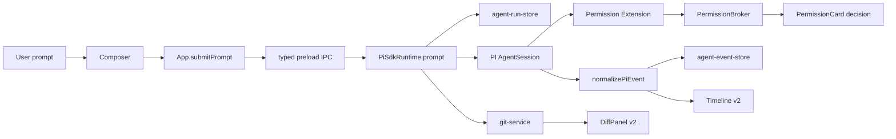

# Modus V0.1.2 执行方案

状态：执行前方案  
日期：2026-06-04  
定位：对标 Cursor Agents Window 的第二条核心交付切片  
目标：把 Modus 从“能跑 PI Agent 的桌面壳”推进到“可控、可审查、可回滚、可隔离的本地 Coding Agent 工作台”。

## 1. 版本概览

V0.1.1 已经完成关键地基：Modus 不再只是外部 `pi --mode rpc` 适配器，而是通过 `@earendil-works/pi-coding-agent` SDK 直接复用 PI Agent loop。当前应用已经具备桌面壳、workspace、session、timeline、composer、`@` 上下文、Git diff、terminal、worktree 管理、permission guard 和本地 SQLite 持久化。

V0.1.2 的核心不是重写 Agent，而是补齐“真实生产环境里一个 Coding Agent 跑完一单所需的外层控制系统”：

- 一次用户请求必须有明确 run 生命周期。
- Timeline 必须像 Cursor 一样清楚展示任务过程。
- 危险动作必须有可交互权限决策，而不是直接静默拒绝。
- Git 面板必须能完成 review / stage / commit 的最小闭环。
- 新 session 必须默认进入独立 worktree，避免 Agent 污染主 checkout。
- 正在运行时必须支持 queue、interrupt、continue。
- `@` 上下文要从“能挂文件”升级到“帮助 Agent 理解项目”。
- 任务结束后要能自动触发一个轻量 Agent Review。

### 1.1 对标 Cursor 的提升点

Cursor 官方文档中，Agents Window 是 agent-first interface，重点能力包括 multi-workspace、new diffs view、parallel agents、local/cloud handoff、worktrees。Cursor Agent 还明确支持 checkpoints、queued messages、immediate messaging、terminal tools、permissions/run mode、semantic search、Agent Review。

Modus V0.1.2 不追求一次覆盖 Cursor 全量能力。它只做本地优先、最小可交付的 8 个任务：

| 方向 | Cursor 对标能力 | Modus V0.1.2 目标 |
| --- | --- | --- |
| Agent lifecycle | Run 有状态、可取消、可完成、可失败 | 建立 `AgentRunInfo` 和 run 级状态 |
| Timeline | 用户消息、思考、工具、终端、最终结果 | 重构为 Cursor 风格极简任务流 |
| Permission | Run Mode、allowlist、sandbox、approval | 先实现 allow once / deny / always allow |
| Git changes | Changes view、diff、commit、review | stage / unstage / discard / commit / grouped diff |
| Worktree | 每个任务独立 checkout | 新 session 创建并绑定独立 worktree |
| Queue/interrupt | queued messages / immediate messaging | 复用 PI `followUp` / `steer` / `abort` |
| Project understanding | semantic search、Explore subagent、rules | 先做轻量搜索、摘要、规则读取 |
| Agent review | quick/deep local changes review | 先做本地 diff 的 review pass |

### 1.2 关键原则

1. **最小化修改**：只补当前能力缺口，不做大面积 UI 重写。
2. **最大化复用 PI**：Agent loop、消息队列、steering、abort、extension、session persistence 优先使用 PI SDK。
3. **最大化复用 Modus 现有结构**：继续使用 `contracts.ts`、typed IPC、SQLite、现有 renderer 组件、Base UI、motion、Tabler Icons、主题 token。
4. **先本地，后云端**：V0.1.2 不做 cloud agent、mobile handoff、Slack/Jira/GitHub bot。
5. **可验证优先**：每个任务必须有具体手动验收和自动测试点。

## 2. 任务优先级总览

### 2.1 P0 必做任务

| 优先级 | 任务 | 预期效果 | 主要依赖 |
| --- | --- | --- | --- |
| P0-1 | Agent Run Lifecycle v2 | 每次 prompt 都有 `running / completed / failed / blocked / cancelled` 状态 | PI event normalizer、agent store、DB |
| P0-2 | Timeline v2 | 聊天过程变成 Cursor 风格任务流，可读、简洁、可追踪 | P0-1、AgentEvent 协议 |
| P0-3 | Permission / Run Mode v1 | 危险工具调用可由用户允许一次、拒绝、始终允许 | PI extension、permission store、PermissionCard |
| P0-4 | Git Changes v2 | Git 面板能完成 diff review、stage、unstage、discard、commit | git-service、DiffPanel、IPC |
| P0-5 | Session-bound Worktree | 新 session 默认隔离在独立 worktree，Agent 不污染主目录 | git-service、agent create、terminal/diff cwd |

### 2.2 P1 应做任务

| 优先级 | 任务 | 预期效果 | 主要依赖 |
| --- | --- | --- | --- |
| P1-1 | Queue / Interrupt / Continue | Agent 运行中可追加、打断、继续 | P0-1、PI `steer/followUp/abort` |
| P1-2 | Project Understanding v2 | `@` 上下文可搜索、摘要、引用规则和项目结构 | context-service、docs-service、rg |
| P1-3 | Agent Review v0 | 任务结束后可对本地改动做自动审查 | P0-1、P0-4、PI review session |

### 2.3 不纳入 V0.1.2 的能力

| 能力 | 暂不做原因 |
| --- | --- |
| Parallel agents / best-of-n | 需要 worktree、run lifecycle、Git review 稳定后再做 |
| Cloud agents | 当前定位本地优先，云端需要认证、VM、repo sync、安全边界 |
| Browser / Design Mode | 对标重要，但不是本阶段 Agent 闭环关键路径 |
| MCP marketplace | 先完成 permission/run mode，再开放第三方工具 |
| Checkpoint restore | Cursor 很关键，但 V0.1.2 先用 Git/worktree 做可恢复边界 |

## 3. 详细任务分解

## 3.1 P0-1 Agent Run Lifecycle v2

### 目标

把当前 session 级状态升级为 run 级状态。一次用户 prompt 就是一条 run。run 必须能从开始到结束被清楚追踪：

```ts
type AgentRunStatus =
  | "running"
  | "completed"
  | "failed"
  | "blocked"
  | "cancelled";
```

当前 `AgentSessionInfo.status` 只有 `"starting" | "running" | "idle" | "exited" | "error"`，无法表达一次任务是否完成、失败、被权限阻塞、被用户取消，也无法给 Timeline 和 Review 提供稳定触发点。

### Cursor 对标实现

Cursor Agent 把一次任务视为可等待、可排队、可打断、可回滚的工作单元。Cursor SDK 文档也把 `Agent` 和 `Run` 分开：Agent 是持久容器，Run 是一次 prompt 的单位，拥有状态、stream、result、cancel。

Modus 当前 PI SDK 没有直接暴露 Cursor SDK 那种 `Run` 对象，但 PI 的 `prompt()`、`agent_start`、`agent_end`、`turn_start`、`turn_end`、`runtime.error`、`abort()` 足够构建 Modus 自己的 run 记录。

### 当前差距

源码触点：

- `apps/desktop/src/shared/contracts.ts`
  - 当前 `AgentSessionInfo.status` 只有 session 状态。
  - 当前 `AgentEvent` 没有 run id。
- `apps/desktop/src/main/agent/pi-sdk-runtime.ts`
  - `prompt()` 只在开始时把 session 置为 `running`，结束后置为 `idle`。
  - 捕获错误后置为 `error`，没有 run 记录。
- `apps/desktop/src/main/agent/pi-event-normalizer.ts`
  - 已归一化 `agent_start/end`、message、tool、queue、compaction。
  - 未归一化 `turn_start/end`，也没有 run lifecycle event。
- `apps/desktop/src/main/db/database.ts`
  - 没有 `agent_runs` 表。
- `apps/desktop/src/renderer/src/app/App.tsx`
  - 仅靠 `agentEvents` 渲染 timeline，缺 run 状态。

### 技术方案

新增 run 数据模型：

```ts
export type AgentRunInfo = {
  id: string;
  sessionId: string;
  userMessageId: string;
  status: "running" | "completed" | "failed" | "blocked" | "cancelled";
  prompt: string;
  model?: string;
  startedAt: string;
  endedAt?: string;
  error?: string;
  blockReason?: string;
};
```

新增 AgentEvent：

```ts
| { type: "run.started"; sessionId: string; runId: string; userMessageId: string; prompt: string }
| { type: "run.completed"; sessionId: string; runId: string }
| { type: "run.failed"; sessionId: string; runId: string; message: string }
| { type: "run.blocked"; sessionId: string; runId: string; request: PermissionRequest }
| { type: "run.cancelled"; sessionId: string; runId: string; reason?: string }
```

数据库新增：

```sql
create table if not exists agent_runs (
  id text primary key,
  session_id text not null references agent_sessions(id) on delete cascade,
  user_message_id text not null,
  status text not null,
  prompt text not null,
  model text,
  started_at text not null,
  ended_at text,
  error text,
  block_reason text
);
```

实现步骤：

1. 在 `contracts.ts` 中增加 `AgentRunInfo` 和 run events。
2. 在 `database.ts` migration 中新增 `agent_runs`。
3. 新增 `apps/desktop/src/main/agent/agent-run-store.ts`：
   - `createAgentRun(input)`
   - `updateAgentRunStatus(runId, status, metadata?)`
   - `getActiveAgentRun(sessionId)`
   - `listAgentRuns(sessionId)`
4. 在 `PiSdkRuntime.prompt()`：
   - 生成 `runId` 和 `userMessageId`。
   - 先 `recordAgentEvent({ type: "run.started" })`。
   - 调 PI `session.prompt()`。
   - 成功后写 `run.completed`。
   - catch 写 `run.failed`。
   - `abort()` 写 `run.cancelled`。
5. 在 `normalizePiEvent()`：
   - 继续保留现有 message/tool/queue event。
   - 可加入 `turn_start`、`turn_end` 到 notice 或 timeline step，但不把它作为 run 唯一来源。
6. 在 IPC 增加：
   - `agent:list-runs`
   - 可选 `agent:get-active-run`

### 关键代码修改点

| 文件 | 修改 |
| --- | --- |
| `apps/desktop/src/shared/contracts.ts` | 增加 `AgentRunInfo`、run events、扩展 `AgentSessionInfo.status` |
| `apps/desktop/src/main/db/database.ts` | 新增 `agent_runs` 表 |
| `apps/desktop/src/main/agent/agent-run-store.ts` | 新增 run persistence |
| `apps/desktop/src/main/agent/pi-sdk-runtime.ts` | prompt/abort 写 run lifecycle |
| `apps/desktop/src/main/agent/pi-event-normalizer.ts` | 补 `turn_start/end` 映射 |
| `apps/desktop/src/main/ipc/channels.ts` | 增加 run IPC channel |
| `apps/desktop/src/main/ipc/register-app-ipc.ts` | 注册 run list/get handler |
| `apps/desktop/src/preload/index.ts`、`types.ts` | 暴露 typed API |

### UI/UX 要求

- Composer 附近显示当前 run 状态：`Running`、`Completed`、`Failed`、`Blocked`、`Cancelled`。
- Timeline 顶部或最终结果位置显示最终状态，不要用大卡片。
- 失败状态只显示一行错误摘要，详细错误放可展开区域。
- 被权限阻塞时，显示 permission action row，并在 run 状态显示 `Blocked`。

### 验证标准

自动验证：

- `pi-event-normalizer.test.ts` 增加 `turn_start/end` 和 run 相关映射测试。
- `agent-run-store` 增加 SQLite 写入、更新、查询测试。
- `npm --workspace @modus/desktop run test` 通过。
- `npm run check` 通过。

手动验证：

1. 打开 workspace，新建 session，发送 prompt。
2. 发送后 `agent_runs` 出现一条 `running` 记录。
3. PI 完成后该 run 变为 `completed`。
4. 制造错误后 run 变为 `failed`。
5. 点击 stop 后 run 变为 `cancelled`。
6. 触发危险命令时 run 变为 `blocked`，并显示 permission row。

## 3.2 P0-2 Timeline v2

### 目标

把当前 Timeline 从“事件堆叠”升级为 Cursor 风格极简任务流：

- 用户消息：右侧简洁 bubble，无角色标签。
- 思考：折叠为 `Thought for Xs`。
- 工具：一行 row，图标 + 动作 + 状态。
- 终端：命令和输出用极简 row，必要时可展开。
- 权限：危险动作显示明确按钮。
- 最终结果：任务结束后显示简短 completion summary。

### Cursor 对标实现

Cursor 的 Agent timeline 强调过程可读性：用户能看到思考、工具、terminal、diff、review，但不会被原始 JSON 或重型卡片打断。Cursor 也支持 checkpoint / restore，但 V0.1.2 先不做 checkpoint，只把任务流显示稳定下来。

### 当前差距

源码触点：

- `Timeline.tsx`
  - `buildBlocks()` 已把 message/tool/permission/notice 合并成 block。
  - 但没有 run block，没有 final result block。
- `MessageBlock.tsx`
  - 已有 user bubble 和 `Thought for Xs` 折叠雏形。
  - Assistant 空内容时仍会显示 `Thinking...`，需要由 run 状态区分。
- `ToolCard.tsx`
  - 已是轻量工具 row，但还没有 terminal 专用展示。
- `PermissionCard.tsx`
  - 只展示危险提示，无按钮。
- `App.tsx`
  - 已有 sticky user message UX。

### 技术方案

扩展 block 类型：

```ts
type TimelineBlock =
  | MessageBlockItem
  | ThoughtBlockItem
  | ToolBlockItem
  | TerminalBlockItem
  | PermissionBlockItem
  | RunResultBlockItem
  | NoticeBlockItem;
```

构建规则：

1. `message.started/delta/completed` 继续合并为 message block。
2. `thinking.delta` 不直接塞入 assistant message，而是关联最近 assistant message 或 run，生成 thought block。
3. `tool.started/output/ended` 生成 one-line tool row。
4. `toolName === "bash"` 或 PI 返回 shell 工具名时，生成 terminal row。
5. `permission.requested` 或 `run.blocked` 生成 permission block。
6. `run.completed/failed/cancelled` 生成 final result row。

### 关键代码修改点

| 文件 | 修改 |
| --- | --- |
| `Timeline.tsx` | 重构 `buildBlocks()`，支持 run / thought / terminal / final result |
| `MessageBlock.tsx` | 去掉 assistant 默认 `Thinking...`，由 ThoughtBlock 控制 |
| `ToolCard.tsx` | 改名或扩展为 `ToolRow`，保持现有样式 |
| `PermissionCard.tsx` | 加 permission buttons，接入 P0-3 |
| `App.tsx` | 传入 run 状态，保留 sticky UX |

### UI/UX 要求

- 使用现有 token：`text-sm` 主体、`text-xs` 辅助、`text-fg / fg-muted / fg-subtle / fg-faint`。
- 使用 Tabler outline icons，统一 `size={15}` 或 `size={16}`、`stroke={1.65}`。
- 动画使用 motion：
  - 新 row：opacity 0 -> 1，duration 120-160ms。
  - Thought 展开：height auto + opacity，ease `[0.22, 1, 0.36, 1]`。
- 不使用重型卡片，不显示 `assistant` / `user` 标签。
- JSON 参数默认折叠，只有 hover/click 展开。

### 验证标准

自动验证：

- `buildBlocks()` 增加 unit tests：
  - user message 不丢内容。
  - thinking 被合并为 thought block。
  - bash tool 进入 terminal row。
  - run.completed 产生 final result row。

手动验证：

1. 发普通消息，看到右侧 user bubble。
2. Agent 思考时只看到 `Thought for Xs`。
3. 工具调用只显示一行，不出现原始大 JSON。
4. Bash/terminal 工具有 terminal icon 和命令摘要。
5. 任务完成后显示一行完成状态。
6. 滚动时上一条用户消息仍能 sticky 置顶。

## 3.3 P0-3 Permission / Run Mode v1

### 目标

把当前“发现危险操作就直接 deny”的 permission guard，升级为用户可交互的最小 Run Mode：

- Allow once：本次允许。
- Deny：拒绝本次。
- Always allow：对当前 workspace / action / target pattern 始终允许。
- Dangerous warning：危险操作必须明确红色提示。

### Cursor 对标实现

Cursor Agent Security 和 Terminal docs 说明：

- 默认 terminal commands 需要 approval。
- Run Mode 包含 Allowlist、Allowlist with Sandbox、Run Everything、Auto-review。
- `permissions.json` 可配置 terminal/MCP allowlist。
- 文件删除、dotfile、网络等需要特殊保护。

Modus V0.1.2 不做 sandbox 和 Auto-review classifier，只做最小 human-in-the-loop permission broker。

### 当前差距

源码触点：

- `pi-permission-extension.ts`
  - 当前 `tool_call` 发现危险操作后：
    - `recordPermissionDecision(..., "deny")`
    - emit `permission.requested`
    - return block
  - 没有等待 renderer 用户选择。
- `permission-store.ts`
  - 记录 decision，但没有 allowlist 匹配逻辑。
- `PermissionCard.tsx`
  - 只展示 action/target/reason，无按钮。
- `register-app-ipc.ts`
  - 有 `permissionDecide`，但不参与 PI 工具调用等待。

### 技术方案

新增 `PermissionBroker`：

```ts
type PermissionDecisionValue = "allow-once" | "allow-workspace" | "deny";

type PendingPermission = {
  request: PermissionRequest;
  resolve: (decision: PermissionDecisionValue) => void;
  createdAt: string;
};
```

核心行为：

1. PI extension 收到危险 `tool_call`。
2. 先检查 `permission-store` 是否有 matching allow-workspace。
3. 如果有，返回 `undefined`，允许 PI 继续执行。
4. 如果没有，创建 pending permission。
5. emit `permission.requested`。
6. 等待 renderer 调用 `permission.decide({ requestId, decision })`。
7. `allow-once`：当前 tool call 放行。
8. `allow-workspace`：持久化 allowlist 后放行。
9. `deny`：返回 `{ block: true, reason }`。
10. 如果超时，默认 deny，并把 run 标为 `blocked`。

注意：PI extension 的 `tool_call` handler 是 async，可以等待 Promise。这是本阶段最小化复用 PI 的关键。

### Run Mode v1

只实现两个模式：

| Mode | 行为 |
| --- | --- |
| `manual` | 危险动作都需要用户确认 |
| `allowlist` | 已 allow-workspace 的动作自动通过，其余询问 |

暂不做：

- `run-everything`
- sandbox
- Auto-review classifier
- `permissions.json`

### 关键代码修改点

| 文件 | 修改 |
| --- | --- |
| `apps/desktop/src/main/permissions/permission-broker.ts` | 新增 pending permission 管理 |
| `permission-store.ts` | 增加 allowlist 查询和 target pattern |
| `pi-permission-extension.ts` | 改为等待 broker decision |
| `contracts.ts` | PermissionRequest 增加 `requestId/sessionId/runId/severity` |
| `register-app-ipc.ts` | `permissionDecide` 改为进入 broker |
| `PermissionCard.tsx` | 增加 Allow once / Deny / Always allow 按钮 |
| `Timeline.tsx` | permission block 支持 pending/resolved 状态 |

### UI/UX 要求

- Permission row 不做大弹窗，直接在 timeline 中显示。
- 危险操作使用 `danger` token，但只在 icon、边线、按钮上体现，不整块大红。
- 按钮文案：
  - `Allow once`
  - `Deny`
  - `Always allow`
- 目标路径或命令使用 mono 字体，单行截断，可展开查看完整内容。
- 如果 `target` 包含 `rm -rf`、`git clean`、`.env`、`.git`、绝对路径、父级路径 `..`，显示 `High risk`。

### 验证标准

自动验证：

- `permission-broker`:
  - pending request resolve。
  - allow-workspace 命中后不再 pending。
  - timeout 默认 deny。
- `pi-permission-extension`:
  - safe tool 直接通过。
  - dangerous bash 等待 broker。

手动验证：

1. 要求 Agent 执行普通 `ls`，不弹权限。
2. 要求 Agent 执行 `rm -rf tmp-test`，timeline 出现 permission row。
3. 点击 Deny，run 变为 `blocked`，工具不执行。
4. 点击 Allow once，当前工具执行，但下次仍询问。
5. 点击 Always allow，同类 action/target 后续自动执行。

## 3.4 P0-4 Git Changes v2

### 目标

把当前 Git 面板从“能看 diff 和 revert”升级为最小可交付的 Cursor 风格 Changes 工作区：

- 文件分组：Staged / Unstaged / Untracked。
- 文件级 stage / unstage。
- discard file。
- commit message 输入。
- commit。
- diff preview。
- add/remove count。

### Cursor 对标实现

Cursor Agents Window 的 new diffs view 支持 review and commit changes without leaving Cursor。Agent Review 也可以从 Source Control tab 对所有 local changes 做 review。V0.1.2 只实现本地 Git 基础闭环，不做 PR 管理。

### 当前差距

源码触点：

- `git-service.ts`
  - `listChanges()` 用 `git status --porcelain=v1`，只返回 `status/path`。
  - `readDiff()` 只读 unstaged diff。
  - `revertFile()` 用 `git restore --source=HEAD -- path`。
  - 没有 stage/unstage/commit/staged diff。
- `contracts.ts`
  - `FileChange` 只有 `path/status`。
- `DiffPanel.tsx`
  - 单列表，无 staged/unstaged/untracked 分组。
  - 有 revert button，无 stage/unstage/commit。

### 技术方案

扩展类型：

```ts
export type FileChange = {
  path: string;
  originalPath?: string;
  indexStatus: string;
  worktreeStatus: string;
  staged: boolean;
  untracked: boolean;
  renamed: boolean;
};

export type DiffMode = "unstaged" | "staged" | "head";
```

Git service 新增：

```ts
export async function stageFile(cwd: string, filePath: string): Promise<void>;
export async function unstageFile(cwd: string, filePath: string): Promise<void>;
export async function discardFile(cwd: string, filePath: string): Promise<void>;
export async function commitChanges(cwd: string, message: string): Promise<void>;
export async function readDiff(cwd: string, filePath?: string, mode?: DiffMode): Promise<FileDiff>;
```

实现细节：

- `listChanges()` 改为 `git status --porcelain=v1 -z`，避免空格路径解析错误。
- staged 判断：index status 非空且不是 `?`。
- unstaged 判断：worktree status 非空。
- untracked 判断：`??`。
- staged diff：`git diff --cached -- file`。
- unstaged diff：`git diff -- file`。
- discard:
  - tracked：`git restore --worktree -- file`
  - staged：先 `git restore --staged -- file`
  - untracked：用 `rm` 风险较高，必须走 permission broker 或二次确认。V0.1.2 可先禁用 untracked discard，显示 “Use terminal or confirm in next version”。
- commit:
  - `git commit -m <message>`
  - commit 前如果没有 staged changes，禁用按钮。

### 关键代码修改点

| 文件 | 修改 |
| --- | --- |
| `contracts.ts` | 扩展 `FileChange`、`FileDiff`、新增 `DiffMode` |
| `git-service.ts` | 新增 stage/unstage/discard/commit/staged diff |
| `ipc/channels.ts` | 新增 diff stage/unstage/discard/commit channel |
| `register-app-ipc.ts` | 注册 Git IPC |
| `preload/index.ts`、`types.ts` | 暴露 typed API |
| `DiffPanel.tsx` | 分组 UI、文件操作按钮、commit input |

### UI/UX 要求

- 右侧面板仍使用纯图标 tab。
- Git header 显示：
  - `N Uncommitted Changes`
  - `+added -removed`
  - refresh icon。
- 文件 row：
  - 左侧 chevron + file icon + path。
  - 右侧 hover 显示 stage/unstage/discard。
  - selected row 使用单层 `bg-active`，禁止重叠背景。
- Commit box：
  - 放在 Changes 列表底部或顶部折叠区。
  - 单行 input + Commit button。
  - 没有 staged changes 时 disabled。
- Diff preview：
  - 继续用当前内联 preview，不引入 Monaco 大组件。

### 验证标准

自动验证：

- `git-service.test.ts` 使用临时 repo：
  - modified 文件进入 unstaged。
  - `stageFile` 后进入 staged。
  - `unstageFile` 后回到 unstaged。
  - `readDiff(..., "staged")` 有 cached diff。
  - commit 后 listChanges 为空。

手动验证：

1. 打开 Git repo，修改一个文件。
2. Changes 面板显示 Unstaged。
3. 点击 stage，文件移动到 Staged。
4. 点击 unstage，文件回到 Unstaged。
5. 输入 commit message，点击 commit。
6. Git log 出现 commit，Changes 清空。

## 3.5 P0-5 Session-bound Worktree

### 目标

新建 Agent session 时默认创建独立 Git worktree，并把该 session 的 cwd 绑定到 worktree。Agent 后续读写、terminal、diff、Git review 都必须针对该 worktree，而不是主 checkout。

### Cursor 对标实现

Cursor worktrees 让 Agent 在 isolated Git checkouts 中工作，每个任务有自己的 files、dependencies、changes，主 checkout 不被污染。Cursor 还支持 `/worktree`、`/best-of-n`、cleanup 和 apply/delete。V0.1.2 只做 session-bound worktree，不做 best-of-n。

### 当前差距

源码触点：

- `git-service.ts`
  - 已有 `createWorktree(cwd, taskId)`，路径为 `.modus/worktrees/<taskId>`，branch 为 `modus/<taskId>`。
- `agent-store.ts`
  - `AgentSessionInfo` 已有 `worktreePath` 字段。
- `PiSdkRuntime.create()`
  - 直接使用 `input.cwd` 创建 PI session。
  - 未自动创建 worktree。
- `App.tsx`
  - `createSession()` 传入 workspace rootPath。
- `Inspector.tsx`
  - `DiffPanel` 和 `TerminalPanel` 使用 `activeWorkspace.rootPath`，不是 `agentSession.worktreePath ?? cwd`。

### 技术方案

新增 session create 策略：

```ts
type CreateAgentRuntimeInput = {
  workspaceId: string;
  cwd: string;
  title: string;
  model?: string;
  worktreeMode?: "auto" | "off";
};
```

默认：

- Git repo：`worktreeMode = "auto"`。
- 非 Git repo：不创建 worktree，直接使用 cwd。

创建流程：

1. `PiSdkRuntime.create()` 判断 cwd 是否 Git repo。
2. 生成 task id：`session-${timestamp}-${shortRandom}`。
3. 调 `createWorktree(input.cwd, taskId)`。
4. `effectiveCwd = worktree.path`。
5. `createAgentSessionRecord({ cwd: effectiveCwd, worktreePath: worktree.path })`。
6. `DefaultResourceLoader({ cwd: effectiveCwd })`。
7. `SessionManager.create(effectiveCwd, sessionDir)`。
8. renderer 展示 session 的 workspace 名和 worktree branch。

Inspector cwd 修正：

```ts
const activeCwd = agentSession?.worktreePath ?? agentSession?.cwd ?? activeWorkspace?.rootPath;
```

把 `activeCwd` 传给：

- `DiffPanel`
- `TerminalPanel`
- `WorktreesPanel`
- `Composer` context search/resolve

### 关键代码修改点

| 文件 | 修改 |
| --- | --- |
| `runtime.ts` | `CreateAgentRuntimeInput` 增加 `worktreeMode` |
| `pi-sdk-runtime.ts` | create 时自动创建并绑定 worktree |
| `git-service.ts` | `createWorktree` 增强 branch/path 冲突处理 |
| `App.tsx` | 计算 `activeAgentCwd`，传给 Composer/Inspector |
| `Inspector.tsx` | 用 session cwd 替代 workspace root cwd |
| `Sidebar.tsx` | session row 可显示 worktree branch 小字 |

### UI/UX 要求

- Session row 可使用小图标或短文案显示 `worktree`，但不要占太多空间。
- Chat top bar 的 environment chip 显示 `Worktree` 或 branch name。
- Right panel Git header 显示当前 cwd 类型：`Local` / `Worktree`。
- 如果 worktree 创建失败，回退到 main cwd 前必须提示用户，不静默落到主 checkout。

### 验证标准

自动验证：

- `createWorktree` 路径冲突测试。
- `PiSdkRuntime.create` 在 Git repo 中记录 `worktreePath`。
- 非 Git repo 不创建 worktree。

手动验证：

1. 打开 Git repo，新建 session。
2. `.modus/worktrees/session-*` 被创建。
3. `agent_sessions.cwd` 等于 worktree path。
4. Terminal prompt 位于 worktree path。
5. Git Changes 面板只显示 worktree 的改动。
6. 主 checkout 不出现 Agent 修改。

## 3.6 P1-1 Queue / Interrupt / Continue

### 目标

Agent 运行中，用户可以：

- Enter：把下一条消息加入 follow-up queue。
- Ctrl+Enter：立即 steering / interrupt 当前方向。
- Stop：取消当前 run。
- Continue：任务完成后继续执行同一目标。

### Cursor 对标实现

Cursor Agent 支持 queued messages：Agent 工作时输入下一条，按 Enter 加入队列，Agent 当前任务结束后顺序执行。Cmd/Ctrl+Enter 会 immediate messaging，用于打断或重定向当前工作。

### 当前差距

源码触点：

- PI SDK 已支持：
  - `session.steer(text)`
  - `session.followUp(text)`
  - `session.prompt(text, { streamingBehavior: "steer" | "followUp" })`
  - `session.abort()`
- `pi-event-normalizer.ts` 已映射 `queue_update` 到 `queue.updated`。
- `Composer.tsx`
  - 当前运行中没有区分 Enter / Ctrl+Enter 行为。
- `PiSdkRuntime.prompt()`
  - 如果 runtime session 正在 streaming，直接 `prompt()` 会报错，当前没有 queue 策略。

### 技术方案

Runtime API 扩展：

```ts
export type PromptDelivery = "normal" | "follow-up" | "steer";

export type PromptAgentInput = {
  sessionId: string;
  message: string;
  context: ContextItem[];
  delivery?: PromptDelivery;
};
```

`PiSdkRuntime.prompt()`：

- `delivery === "follow-up"` -> `session.followUp(message)`
- `delivery === "steer"` -> `session.steer(message)`
- `delivery === "normal"` -> `session.prompt(message)`
- 如果 `session.isStreaming && delivery` 未传，默认 follow-up。

Renderer：

- App 根据 active run 状态给 Composer 传 `isRunning`。
- Composer:
  - running + Enter：`delivery="follow-up"`
  - running + Ctrl+Enter：`delivery="steer"`
  - not running + Enter：`delivery="normal"`
- queue.updated 显示在 composer 上方一行：
  - `2 queued`
  - 可简单显示队列内容，暂不做拖拽 reorder。

Continue：

- 任务完成后在 final result row 或 Composer 上方显示 `Continue`。
- 点击后发送固定 prompt：`Continue from the last result. Verify remaining work and finish the task.`
- 仍走 normal delivery。

### 关键代码修改点

| 文件 | 修改 |
| --- | --- |
| `contracts.ts` | 增加 delivery 类型 |
| `runtime.ts` | PromptAgentInput 增加 delivery |
| `pi-sdk-runtime.ts` | 复用 PI `steer/followUp` |
| `App.tsx` | 追踪 active run status，传 Composer |
| `Composer.tsx` | running 时 Enter/Ctrl+Enter 行为 |
| `Timeline.tsx` | 显示 queue.updated 和 Continue |

### 验证标准

自动验证：

- Runtime 在 `delivery=follow-up` 时调用 `followUp`。
- Runtime 在 `delivery=steer` 时调用 `steer`。

手动验证：

1. Agent 正在工作时输入第二条消息，按 Enter。
2. UI 显示 queued。
3. 当前任务结束后自动执行 queued message。
4. Agent 正在工作时按 Ctrl+Enter，Agent 方向被立即更新。
5. 点击 Stop，run 变为 `cancelled`。
6. 点击 Continue，发送继续 prompt。

## 3.7 P1-2 Project Understanding v2

### 目标

把 `@` 上下文从“文件/目录/diff/terminal/docs 基础挂载”升级为更像 Cursor 的项目理解入口：

- `@file`：继续支持。
- `@folder`：继续支持。
- `@git diff`：继续支持。
- `@terminal`：继续支持。
- `@docs`：继续支持 Markdown docs。
- 新增 `@project summary`：项目结构摘要。
- 新增 `@recent changes`：最近 Git 改动摘要。
- 新增 `@rules`：读取 `AGENTS.md`、`.cursor/rules`、`.codex/skills` 等轻量规则。
- 新增 symbol/string search：基于 `rg`，不引入向量库。

### Cursor 对标实现

Cursor search docs 中区分 Instant Grep、Semantic search、Explore subagent。Agent 会根据 prompt 自动选择 grep、semantic search、file reads。V0.1.2 不做 semantic index，只做快速 `rg` 和项目摘要，让 Modus 的本地 agent 有更好的第一层项目理解。

### 当前差距

源码触点：

- `context-service.ts`
  - `searchContext()` 已支持 terminal/doc/git-diff/file search。
  - `resolveContext()` 已支持 file/folder/terminal/git-diff/doc。
  - 文件大小限制 64KB，folder entries 80。
- `docs-service.ts`
  - 支持 Markdown indexing 和 chunks。
- 目前没有：
  - project summary。
  - rules discovery。
  - recent changes summary。
  - symbol search。

### 技术方案

扩展类型：

```ts
export type ContextKind =
  | "file"
  | "folder"
  | "doc"
  | "terminal"
  | "git-diff"
  | "project-summary"
  | "recent-changes"
  | "rules"
  | "search";
```

新增 service：

```text
apps/desktop/src/main/context/project-understanding-service.ts
```

函数：

- `buildProjectSummary(cwd)`
  - 使用 `rg --files`
  - 忽略 `.git`、`node_modules`、`.modus`
  - 输出目录分布、重要文件、package scripts、语言猜测。
- `searchProject(cwd, query)`
  - 使用 `rg -n --hidden --glob '!node_modules' --glob '!.git' query`
  - 最多 50 行结果。
- `readProjectRules(cwd)`
  - 查找：
    - `AGENTS.md`
    - nested `AGENTS.md`
    - `.cursor/rules/*.mdc`
    - `.codex/skills/*/SKILL.md`
    - `.agents/skills/*/SKILL.md`
  - V0.1.2 只读文本，不做自动 skill invocation。
- `summarizeRecentChanges(cwd)`
  - 基于 `git status` 和 `git diff --stat`。

### 关键代码修改点

| 文件 | 修改 |
| --- | --- |
| `contracts.ts` | 扩展 ContextKind / ContextItem |
| `context-service.ts` | 接入 project summary/search/rules/recent changes |
| `project-understanding-service.ts` | 新增轻量项目理解逻辑 |
| `ContextMentionMenu.tsx` | 新类型图标和文案 |
| `useComposerMentions.ts` | 支持新 query 关键词 |

### UI/UX 要求

- 输入 `@project` 时显示 `Project Summary`。
- 输入 `@rules` 时显示 `Project Rules`。
- 输入 `@changes` 时显示 `Recent Changes`。
- 搜索结果使用现有 mention menu，不新增新弹窗。
- detail 文案不超过一行。

### 验证标准

自动验证：

- `project-understanding-service` 对临时 repo 生成 summary。
- rules discovery 能读 root/nested `AGENTS.md`。
- `searchProject` 能返回匹配行并限制数量。

手动验证：

1. 输入 `@project`，选择 Project Summary。
2. prompt 中附带项目摘要。
3. 输入 `@rules`，能附带 AGENTS.md 或规则文件。
4. 输入 `@changes`，能附带 git diff/stat 摘要。

## 3.8 P1-3 Agent Review v0

### 目标

任务结束后，提供一个最小 Agent Review：

- 手动：Git 面板点击 `Review`。
- 自动：run completed 后，如果有 diff，显示 `Run review` action。
- Review 输出 issues 列表。
- Quick / Deep 两档。

### Cursor 对标实现

Cursor Agent Review 可以：

- 自动在任务后运行。
- 通过 `/agent-review` 触发。
- 从 Source Control tab 触发，比较 local changes 和 main branch。
- 支持 Quick / Deep。

Modus V0.1.2 不做 PR/Bugbot，只做本地 diff review。

### 当前差距

当前没有 review service，也没有 review event。Git 面板只有 diff/revert，不会在任务结束后审查变更。

### 技术方案

新增类型：

```ts
export type AgentReviewDepth = "quick" | "deep";

export type AgentReviewIssue = {
  id: string;
  file?: string;
  line?: number;
  severity: "low" | "medium" | "high";
  title: string;
  detail: string;
  suggestion?: string;
};
```

新增 service：

```text
apps/desktop/src/main/review/agent-review-service.ts
```

实现策略：

1. 读取当前 cwd 的 staged + unstaged diff。
2. 创建独立 PI session 或复用当前 session 的 read-only review prompt。
3. Prompt 明确要求：
   - 只审查 diff。
   - 不改文件。
   - 输出 JSON issues。
   - 高置信度优先。
4. 解析 JSON，失败则回退为 markdown summary。
5. 存储 review result。

推荐先使用独立 PI session，避免污染主 Agent 对话。

### 关键代码修改点

| 文件 | 修改 |
| --- | --- |
| `contracts.ts` | 新增 review types/events |
| `database.ts` | 新增 `agent_reviews` 表 |
| `review/agent-review-service.ts` | 新增 review run |
| `register-app-ipc.ts` | 新增 `review:start/list` IPC |
| `DiffPanel.tsx` | 增加 Review button 和结果展示 |
| `Timeline.tsx` | run completed 后显示 review action |

### UI/UX 要求

- Review button 放在 Git panel header 或 commit 区附近。
- Review result 不做大报告页，先用 issue list：
  - severity dot。
  - file:line。
  - title。
  - detail 可展开。
- Quick/Deep 使用小 segmented control 或 dropdown，复用 Base UI。

### 验证标准

自动验证：

- review prompt builder snapshot。
- JSON parsing fallback 测试。

手动验证：

1. 修改代码产生 diff。
2. 点击 Review -> Quick。
3. 出现 review loading。
4. Review 完成后显示 issues 或 “No high-confidence issues found”。
5. Review 不修改任何文件。

## 4. 整体架构调整建议

### 4.1 新增模块结构

```text
apps/desktop/src/main/
├─ agent/
│  ├─ agent-run-store.ts          # 新增：run lifecycle persistence
│  ├─ agent-event-store.ts        # 现有：event persistence
│  ├─ agent-store.ts              # 现有：session persistence
│  ├─ pi-sdk-runtime.ts           # 修改：run/worktree/queue/permission integration
│  ├─ pi-event-normalizer.ts      # 修改：turn/run related mapping
│  └─ runtime.ts                  # 修改：delivery/worktree options
├─ permissions/
│  ├─ permission-store.ts         # 修改：allowlist matching
│  └─ permission-broker.ts        # 新增：pending approval bridge
├─ context/
│  ├─ context-service.ts          # 修改：new context kinds
│  └─ project-understanding-service.ts
├─ git/
│  └─ git-service.ts              # 修改：stage/unstage/commit/staged diff
└─ review/
   └─ agent-review-service.ts     # 新增：local diff review
```

Renderer：

```text
apps/desktop/src/renderer/src/features/
├─ agent/
│  ├─ Timeline.tsx
│  ├─ MessageBlock.tsx
│  ├─ ToolCard.tsx
│  └─ PermissionCard.tsx
├─ composer/
│  ├─ Composer.tsx
│  └─ useComposerMentions.ts
├─ diff/
│  └─ DiffPanel.tsx
└─ inspector/
   └─ Inspector.tsx
```

Shared：

```text
apps/desktop/src/shared/contracts.ts
```

所有新增 IPC 必须继续走：

- `ipc/channels.ts`
- `register-app-ipc.ts`
- `preload/index.ts`
- `preload/types.ts`
- `window.modus.*`

### 4.2 数据流



### 4.3 CWD 规则

V0.1.2 必须明确区分：

| 名称 | 含义 | 用途 |
| --- | --- | --- |
| `workspace.rootPath` | 用户打开的原始项目目录 | sidebar、workspace identity |
| `agentSession.cwd` | 当前 Agent 实际工作目录 | PI runtime、context、terminal、diff |
| `agentSession.worktreePath` | session 绑定的 worktree 路径 | worktree 标识和 cleanup |

渲染层不得再默认把 Git/Terminal/Context 都指向 `activeWorkspace.rootPath`。凡是 session 中的操作，应优先使用：

```ts
agentSession?.worktreePath ?? agentSession?.cwd ?? activeWorkspace?.rootPath
```

### 4.4 主题与 UI token

继续使用 `app.css` 当前 token：

- canvas：`#131314`
- panel：`#161617`
- surface：`#1c1c1d`
- elevated：`#232325`
- hover：`rgba(255, 255, 255, 0.04)`
- active：`rgba(255, 255, 255, 0.06)`
- fg：`#e4e4e3`
- fg-muted：`#b4b4b1`
- fg-subtle：`#8a8a87`
- fg-faint：`#5a5a5d`
- success：`#3fae87`
- danger：`#e5687a`

字号：

- `text-2xs`：11px，status / line number / kbd。
- `text-xs`：12px，secondary metadata。
- `text-sm`：13px，sidebar、timeline row、panel row。
- `text-md`：14px，composer textarea。

图标：

- Tabler outline only。
- 常规 row icon：15px / stroke 1.65。
- 空状态 icon：22px / stroke 1.4。
- 主要 action icon：14-16px，按现有 Composer / Inspector 规格。

Motion：

- row enter：120-160ms opacity。
- height expand：`height: auto` + opacity，160ms，ease `[0.22, 1, 0.36, 1]`。
- panel/width：spring 或现有 `INSPECTOR_TRANSITION`，避免内容残影。

## 5. 实施路线图

### Phase 0：准备与基线

预估：0.5 天

任务：

1. 新建 feature branch。
2. 运行基线：
   - `npm run check`
   - `npm --workspace @modus/desktop run test`
3. 手动打开 app，确认当前 session、timeline、Git、terminal 可用。

验收：

- 基线失败项被记录，不在本阶段顺手修无关问题。

### Phase 1：Agent Run Lifecycle v2

预估：1 天

依赖：无。

执行：

1. 改 `contracts.ts`。
2. 新增 `agent_runs` migration。
3. 新增 `agent-run-store.ts`。
4. 改 `PiSdkRuntime.prompt/abort`。
5. 改 `register-app-ipc/preload` 暴露 run 查询。
6. 加测试。

验收：

- run 状态在 DB 和 UI 中可见。
- completed/failed/cancelled 至少三种状态可手动触发。

### Phase 2：Timeline v2

预估：1.5 天

依赖：Phase 1。

执行：

1. 重构 `buildBlocks()`。
2. 调整 `MessageBlock`，移除 assistant 空内容误显示。
3. 扩展 `ToolCard` 为轻量 row。
4. 增加 final result row。
5. 加 block builder 测试。

验收：

- 一次完整 run 在 timeline 中可读。
- 无角色标签、无大 JSON、无空框残影。

### Phase 3：Permission / Run Mode v1

预估：1.5 天

依赖：Phase 1、Phase 2。

执行：

1. 新增 `permission-broker.ts`。
2. 改 `pi-permission-extension.ts`。
3. 扩展 `permission-store.ts` allowlist 查询。
4. 改 `PermissionCard.tsx`。
5. 改 IPC decision path。
6. 测试 broker。

验收：

- 危险命令可以被 Allow once / Deny / Always allow 控制。
- Deny 后 run blocked。
- Always allow 后同类操作不重复询问。

### Phase 4：Git Changes v2

预估：2 天

依赖：Phase 1 可选，Phase 3 对 discard untracked 有帮助。

执行：

1. 扩展 `FileChange`。
2. 改 `git-service.ts` status parsing。
3. 新增 stage/unstage/discard/commit。
4. 扩展 IPC/preload。
5. 重构 `DiffPanel` 分组和 commit UI。
6. 临时 repo 测试。

验收：

- 可以从 app 内完成 stage -> commit。
- diff preview 对 staged/unstaged 正确。

### Phase 5：Session-bound Worktree

预估：1.5 天

依赖：Phase 4。

执行：

1. 改 `PiSdkRuntime.create()` 自动 worktree。
2. 加 worktree 创建失败提示。
3. App 计算 `activeAgentCwd`。
4. Inspector/Composer/Diff/Terminal 使用 session cwd。
5. Sidebar 显示 worktree 状态。

验收：

- 新 session 修改只落在 worktree。
- 主 checkout 不被污染。

### Phase 6：Queue / Interrupt / Continue

预估：1 天

依赖：Phase 1。

执行：

1. 扩展 PromptAgentInput delivery。
2. Runtime 接 PI `followUp/steer`。
3. Composer running mode key handling。
4. Timeline/Composer 显示 queued 状态。
5. 增加 Continue action。

验收：

- Enter 排队，Ctrl+Enter 打断，Stop 取消，Continue 继续。

### Phase 7：Project Understanding v2

预估：1.5 天

依赖：无强依赖，可在 Phase 4 后并行。

执行：

1. 新增 project-understanding-service。
2. 扩展 context types。
3. 接 `@project`、`@rules`、`@changes`、`@search`。
4. 测试 `rg` 和 rules discovery。

验收：

- `@` 能加入项目摘要、规则、最近改动。

### Phase 8：Agent Review v0

预估：1.5 天

依赖：Phase 1、Phase 4。

执行：

1. 新增 review types/table/service。
2. Git 面板增加 Review action。
3. run completed 后显示 Run review。
4. PI 独立 review session 输出 JSON。
5. Review result UI。

验收：

- Review 不改文件。
- 能输出 issue list 或 no issues。

### 总体时间预估

| Phase | 时间 |
| --- | --- |
| Phase 0 | 0.5 天 |
| Phase 1 | 1 天 |
| Phase 2 | 1.5 天 |
| Phase 3 | 1.5 天 |
| Phase 4 | 2 天 |
| Phase 5 | 1.5 天 |
| Phase 6 | 1 天 |
| Phase 7 | 1.5 天 |
| Phase 8 | 1.5 天 |
| 合计 | 11.5 天 |

建议以 2 周作为 V0.1.2 开发窗口，保留 2-3 天 QA 和 UI polish。

## 6. 风险与注意事项

### 6.1 Permission async hang

风险：PI tool_call 等待 renderer 决策时，如果窗口关闭或 IPC 丢失，Agent 会卡住。

解决：

- PermissionBroker 必须有 timeout。
- 窗口关闭时 pending 全部 deny。
- run 状态标为 `blocked` 或 `cancelled`。

### 6.2 Worktree cwd 混乱

风险：Agent 在 worktree 中改文件，但 DiffPanel/Terminal 仍看主 checkout。

解决：

- 统一 `activeAgentCwd`。
- 所有 session-bound 操作禁止直接用 `activeWorkspace.rootPath`。
- 手动验收必须检查主 checkout 无改动。

### 6.3 Git discard 危险

风险：discard untracked 可能删除用户文件。

解决：

- V0.1.2 不直接删除 untracked，或必须二次权限确认。
- tracked discard 使用 `git restore`。
- 所有 destructive git action 走 PermissionBroker。

### 6.4 Agent Review 污染主对话

风险：把 review prompt 塞进主 session 会污染用户聊天上下文。

解决：

- 使用独立 PI session。
- Review session 不展示到 sidebar，或标记为 hidden/internal。
- Review 不允许写文件。

### 6.5 Timeline 过度复杂

风险：为了复刻 Cursor，把 Timeline 做成复杂状态机，后续难维护。

解决：

- `buildBlocks()` 保持纯函数。
- Event -> Block 的规则写测试。
- 不在 UI 组件里解析复杂 event。

### 6.6 UI scope creep

风险：右侧面板、Sidebar、Timeline 同时大改容易失控。

解决：

- V0.1.2 只改与任务闭环直接相关的 UI。
- 不做新的主题、不换组件库、不引入新图标库。

### 6.7 PI event shape drift

风险：PI SDK 事件类型升级后映射出错。

解决：

- `normalizePiEvent()` 必须有单元测试。
- 对 unknown event 忽略但保留 debug log 开关。

## 7. 成功验收标准

### 7.1 产品验收

V0.1.2 完成后，用户应该能完成下面这一条完整流程：

1. 打开 Modus。
2. 打开一个 Git repo。
3. 新建 session。
4. Modus 自动创建独立 worktree。
5. 用户发送一个 coding task。
6. Timeline 显示用户消息、Thought、工具、终端、最终结果。
7. Agent 尝试危险操作时，用户能选择 Allow once / Deny / Always allow。
8. 用户能在运行中追加 queue 消息或 Ctrl+Enter 打断。
9. Agent 完成后，Git Changes 显示 worktree 内变更。
10. 用户能 stage、unstage、discard tracked file、commit。
11. 用户能运行 Agent Review 检查本地 diff。
12. 主 checkout 不被 Agent 直接污染。

### 7.2 工程验收

必须通过：

```bash
npm run check
npm --workspace @modus/desktop run test
npm --workspace @modus/desktop run build
```

建议补充：

```bash
cargo check -p modus-pty-host
```

### 7.3 单元测试最低要求

| 模块 | 测试 |
| --- | --- |
| `agent-run-store` | create/update/list active run |
| `pi-event-normalizer` | message/tool/queue/turn/run mapping |
| `permission-broker` | allow once / deny / always allow / timeout |
| `git-service` | status parse / stage / unstage / staged diff / commit |
| `project-understanding-service` | summary / rules / search |
| `agent-review-service` | prompt builder / JSON parse fallback |
| `Timeline.buildBlocks` | run/message/thought/tool/permission/final result |

### 7.4 手动 QA 场景

| 场景 | 预期 |
| --- | --- |
| 新建 session | 创建 worktree，session cwd 指向 worktree |
| 普通 prompt | run running -> completed |
| 错误 prompt | run running -> failed |
| Stop | run running -> cancelled |
| 危险命令 | 出现 permission row |
| Deny | tool 不执行，run blocked |
| Allow once | 本次执行，下次仍询问 |
| Always allow | 后续同类操作自动通过 |
| 修改文件 | Git panel 显示 unstaged |
| Stage | 文件进入 staged |
| Unstage | 文件回 unstaged |
| Commit | staged changes 被提交 |
| Queue | running 时 Enter 加入队列 |
| Interrupt | running 时 Ctrl+Enter steer |
| Review | 输出 issue list，不改文件 |

## 8. 调研基线

### 8.1 本地源码调研

本计划基于当前 Modus 源码的以下关键模块：

- `apps/desktop/src/renderer/src/app/App.tsx`
- `apps/desktop/src/shared/contracts.ts`
- `apps/desktop/src/main/db/database.ts`
- `apps/desktop/src/main/agent/pi-sdk-runtime.ts`
- `apps/desktop/src/main/agent/pi-event-normalizer.ts`
- `apps/desktop/src/main/agent/pi-permission-extension.ts`
- `apps/desktop/src/main/agent/agent-store.ts`
- `apps/desktop/src/main/agent/agent-event-store.ts`
- `apps/desktop/src/main/context/context-service.ts`
- `apps/desktop/src/main/docs/docs-service.ts`
- `apps/desktop/src/main/git/git-service.ts`
- `apps/desktop/src/main/ipc/register-app-ipc.ts`
- `apps/desktop/src/renderer/src/features/agent/Timeline.tsx`
- `apps/desktop/src/renderer/src/features/agent/MessageBlock.tsx`
- `apps/desktop/src/renderer/src/features/agent/ToolCard.tsx`
- `apps/desktop/src/renderer/src/features/agent/PermissionCard.tsx`
- `apps/desktop/src/renderer/src/features/composer/Composer.tsx`
- `apps/desktop/src/renderer/src/features/diff/DiffPanel.tsx`
- `apps/desktop/src/renderer/src/features/inspector/Inspector.tsx`
- `apps/desktop/src/renderer/src/features/terminal/TerminalPanel.tsx`
- `apps/desktop/src/renderer/src/styles/app.css`

CodeGraph 调研结论：

- Modus 的核心 Agent loop 已经基于 PI SDK，不需要重写。
- 当前最大缺口在 run lifecycle、permission async bridge、Git staging/commit、session cwd/worktree 绑定。
- 当前 renderer 已有足够 UI 基础，V0.1.2 应做局部增强，不应大改布局。

### 8.2 Cursor 官方资料

本计划参考：

- [Cursor Agent Overview](https://cursor.com/docs/agent/overview)
- [Cursor Agents Window](https://cursor.com/docs/agent/agents-window)
- [Cursor Worktrees](https://cursor.com/docs/configuration/worktrees)
- [Cursor Terminal Tool](https://cursor.com/docs/agent/tools/terminal)
- [Cursor Agent Security](https://cursor.com/docs/agent/security)
- [Cursor permissions.json Reference](https://cursor.com/docs/reference/permissions)
- [Cursor Semantic & Agentic Search](https://cursor.com/docs/agent/tools/search)
- [Cursor Agent Review](https://cursor.com/docs/agent/agent-review)
- [Cursor Rules](https://cursor.com/docs/rules)
- [Cursor Skills](https://cursor.com/docs/skills)
- [Cursor MCP](https://cursor.com/docs/mcp)
- [Cursor Subagents](https://cursor.com/docs/subagents)
- [Cursor 3.0 Changelog](https://cursor.com/changelog/3-0)

### 8.3 PI SDK 资料

本计划参考本地依赖包：

- `node_modules/@earendil-works/pi-coding-agent/docs/sdk.md`
- `node_modules/@earendil-works/pi-coding-agent/docs/extensions.md`
- `node_modules/@earendil-works/pi-coding-agent/examples/extensions/confirm-destructive.ts`
- `node_modules/@earendil-works/pi-coding-agent/examples/extensions/git-checkpoint.ts`
- `node_modules/@earendil-works/pi-coding-agent/examples/sdk/06-extensions.ts`
- `node_modules/@earendil-works/pi-coding-agent/examples/sdk/11-sessions.ts`

PI 可复用能力：

- `AgentSession.prompt()`
- `AgentSession.steer()`
- `AgentSession.followUp()`
- `AgentSession.abort()`
- `AgentSession.subscribe()`
- `SessionManager.create/open/continueRecent/list`
- `DefaultResourceLoader`
- PI extension `tool_call`
- PI extension lifecycle events such as `turn_start` / `turn_end` / `agent_start` / `agent_end`

## 9. 最终判断

V0.1.2 的正确方向是：

> 不重造 Agent loop；复用 PI 的 loop，把 Modus 的产品外壳做成 Cursor 级别的本地控制层。

只要 P0 五项完成，Modus 就会从“能和 Agent 对话”升级为“能让 Agent 在隔离工作区里完成任务，并让用户审查、授权、提交结果”。这是对标 Cursor 的第一条真正产品闭环。
