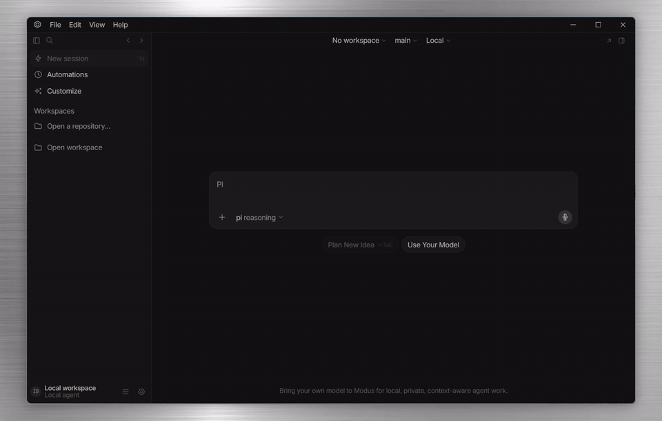

<div align="center">
  <h1>Modus</h1>
  <p><b>An early open-source desktop alternative to Codex App and Cursor Agents Window.</b></p>
</div>

<p align="center">
  
  
  
  
</p>

<p align="center">
  English | <a href="./README.zh-CN.md">Simplified Chinese</a>
</p>

<p align="center">
  <a href="https://github.com/brandlll-lee/modus/releases/download/readme-demo-assets/Modu001.mp4">
    
  </a>
</p>

If you like the idea of Codex App and Cursor, you probably like this dream:

A coding agent can sit beside your repo, read the project, run a terminal, inspect Git changes,
switch models, keep a thread alive, and help you ship work without making every step feel hidden.

Now add one more wish: what if that desktop agent window were open, local-first, and hackable?

That is the bet behind Modus.

Modus is an early desktop app for AI coding agents. It is not trying to pretend it already matches
Codex App or Cursor 3.x. It does not. They are mature products; Modus is still a workshop. But the
direction is clear: build an open-source desktop alternative to the Codex App and Cursor Agents
Window category, then keep closing the gap in public.

## The Honest Position

Today, Modus is the weakest of the three products in the comparison below. That is expected.

Codex App already has a polished desktop experience with worktrees, automations, Git review,
integrated terminal, in-app browser, computer use, skills, MCP, and more. Cursor 3.x has an
agent-first interface with parallel agents, cloud agents, worktrees, PR review, Bugbot, browser
tools, automations, MCP, rules, and Auto-review mode.

Modus currently has the foundation: local desktop shell, projects, sessions, model selection,
context attachments, Git diff, terminal, worktree management, local storage, and a safety layer.

The goal is simple and ambitious: the useful parts Codex App and Cursor have, Modus should
eventually have too, with the product code and roadmap open for people to study, modify, and extend.

> License note: this checkout does not yet include a license file. Add one before distributing
> packaged builds or treating the repo as legally reusable open source.

## Feature Comparison, June 2026

| Capability | Modus today | Codex App | Cursor 3.x+ |
| --- | --- | --- | --- |
| Product positioning | Early local desktop agent app | Mature Codex desktop app | Mature agent-first IDE and Agents Window |
| Source openness | Open-source direction; license still pending | Proprietary product | Proprietary product |
| Desktop agent workspace | Early Electron shell with sidebar, chat, and inspector | Strong desktop thread workspace | Strong Agents Window plus classic editor |
| Local project management | Opens folders, remembers workspaces, detects Git repos | Multi-project desktop workflow | Multi-workspace Agents Window |
| Agent sessions | Local sessions with streaming events and persisted history | Parallel Codex threads | Agent chats, queued messages, checkpoints |
| Model selection | PI model registry and per-session model choice | Codex model and reasoning controls | Model picker, mid-chat model switching |
| Context attachments | Files, folders, terminal output, Git diff, Markdown docs | Rich project, terminal, browser, image, and IDE context | `@` files, folders, docs, terminals, past chats, Git diffs, browser |
| Git review | Basic changes list, diff preview, add/remove counts, revert file | Review pane, inline comments, stage/revert hunks, commit/push/PR | Diffs, PR review, commits tab, file tree, changes picker |
| Integrated terminal | Real PTY terminal via Rust sidecar | Per-thread integrated terminal | Agent terminal execution with sandbox and allowlists |
| Worktrees | List, create, remove Git worktrees | Local/Worktree modes, handoff, cleanup, snapshots | Agents Window worktrees, `/worktree`, `/best-of-n`, cleanup |
| Cloud agents | Not yet | Cloud mode | Cloud Agents from desktop, web, Slack, GitHub, Linear, API |
| Parallel agents | Not yet | Parallel threads and background work | Agents Window, tiled layout, `/multitask`, async subagents |
| Browser/design tools | Not yet | In-app browser, browser comments, browser use | Browser tool, Design Mode, design sidebar, visual editing |
| Computer use | Not yet | Can operate macOS/Windows apps with approval | Cloud agents can use remote desktop/browser control |
| Automations | Sidebar placeholder only | Project and thread automations | Cloud-agent automations, schedules, events, multi-repo/no-repo |
| MCP/plugins/skills | Not yet wired as a user feature | MCP plus Agent Skills and plugins | MCP, MCP Apps, marketplace, skills, subagents, hooks |
| Rules/memories | Not yet | Skills, rules, memories depending on setup | Project/user/team rules, AGENTS.md, memories in automations |
| PR/code review automation | Not yet | `/review` and review pane workflows | Bugbot, Bugbot Autofix, Cursor Review |
| Permission model | Early typed IPC and PI tool-call guardrails | Approvals and sandbox settings | Sandbox, allowlists, `permissions.json`, Auto-review mode |
| Non-code artifacts | Not yet | PDF, spreadsheets, docs, presentations preview/output | Strong browser/design/artifact workflows, varies by feature |

## What Modus Does Today

The current source code already gives Modus the bones of a real local agent cockpit:

- **Desktop shell**: an Electron app with a custom menu bar, left sidebar, chat area, and right
  inspector panel.
- **Workspaces**: open a local folder, remember recent projects, and detect whether the folder is
  a Git repository.
- **Agent sessions**: create a session, send prompts, stream agent events, store chat history
  locally, and reopen previous sessions from the sidebar.
- **Model selection**: list models from the PI model registry, choose a default model, set a model
  per session, and cycle models from the keyboard.
- **Context with `@`**: attach files, folders, terminal output, Git diffs, or indexed Markdown docs
  to a prompt.
- **Git review**: list changed files, preview diffs, count added and removed lines, and revert a
  file through the app.
- **Real terminal**: create PTY-backed terminal sessions through a small Rust sidecar and render
  them with xterm.js.
- **Worktrees**: list, create, and remove Git worktrees for isolated agent tasks.
- **Security surface**: run the renderer without Node privileges, expose a typed preload API, check
  IPC senders, and block dangerous PI tool calls before they execute.
- **Local storage**: persist workspaces, sessions, agent events, permissions, terminal output, and
  Markdown doc chunks in a local SQLite database.

## A Tiny Tour

Open Modus and the left side feels like a project shelf. Pick a workspace, or open a new folder.
Under each project, sessions sit like small notebooks with their last active time.

The middle is where you talk to the agent. Type a request, add `@README.md` or `@git diff`, choose
the model you want, and send. User messages appear as simple bubbles. Agent thoughts and tool work
stream into the timeline without hiding what happened.

The right panel is the workbench drawer. One tab shows Git changes. One tab is a real terminal.
One tab manages worktrees. One tab shows the desktop security state. The idea is simple: when the
agent touches your project, the proof should be right next to the conversation.

## Quick Start

### Requirements

- Node.js `>=22.19.0`
- npm
- Rust with Cargo
- Git
- PI model credentials/configuration available to `@earendil-works/pi-coding-agent`

### Install

```bash
npm install
```

### Run The Desktop App

```bash
npm run dev
```

Then:

1. Click **Open workspace**.
2. Choose a local project folder.
3. Start a new chat.
4. Pick a model from the composer.
5. Type a prompt, or add context with `@`.
6. Check the right panel for Git changes, terminal sessions, worktrees, and security state.

### Build

```bash
npm --workspace @modus/desktop run build
```

This builds the Electron app and the Rust `modus-pty-host` sidecar.

### Package

```bash
npm --workspace @modus/desktop run package:win -- --publish never
```

The packaging config includes the Rust terminal sidecar as an unpacked binary resource.

## Project Layout

```text
modus/
├─ apps/
│  ├─ desktop/              # Electron desktop app
│  └─ web/                  # Future website placeholder
├─ crates/
│  └─ pty-host/             # Rust PTY sidecar used by the terminal panel
├─ docs/
│  └─ architecture/         # Architecture notes
├─ packages/                # Shared package placeholders
├─ MODUS_V0.1.0_EXECUTION_PLAN.md
└─ MODUS_V0.1.1_EXECUTION_PLAN.md
```

## Architecture In Plain English

```text
Renderer UI
  The visible app: sidebar, chat, composer, inspector, terminal, diff panel.

Preload bridge
  A narrow typed doorway called window.modus.

Electron main process
  The trusted side: workspace, Git, terminal, docs, model, permission, and agent services.

Rust PTY sidecar
  A small helper that runs real terminal sessions without putting native terminal code in React.

SQLite
  The local notebook where Modus remembers workspaces, sessions, events, permissions, docs, and
  terminal output.
```

The important part: the UI cannot freely touch your machine. It asks the main process through a
typed API. Dangerous agent tool calls pass through a permission extension before they run.

## Tech Stack

| Layer | Current implementation |
| --- | --- |
| Desktop | Electron 42, electron-vite |
| UI | React 19, Base UI, Tailwind CSS v4, Motion, Tabler Icons |
| Terminal | xterm.js plus Rust `modus-pty-host` |
| Agent runtime | `@earendil-works/pi-coding-agent` PI SDK |
| Local data | Node `node:sqlite` |
| Diff and Git | Git CLI services |
| Quality | TypeScript, Biome, Vitest |
| Packaging | electron-builder |

## What Is Still Early

Modus is usable as a local prototype, but it is still young:

- The UI is still being polished toward a Cursor-class feel.
- Permission review exists, but the user-facing approval flow is still early.
- Terminal output is stored, but full terminal replay is not mature yet.
- Markdown docs can be indexed and searched, but this is not a full knowledge base.
- Worktrees can be managed, but full task orchestration is still ahead.
- MCP, cloud agents, browser tools, automations, rules, memories, PR review automation, and
  computer use are not implemented yet.
- Cross-platform packaging, signing, auto-update, and release channels are not finished.
- This checkout does not currently include a license file; add one before distributing builds.

## Development Commands

```bash
npm run dev
npm run check
npm run format
npm run test
npm --workspace @modus/desktop run build
npm --workspace @modus/desktop run package:win -- --publish never
cargo check -p modus-pty-host
```

## Sources Used For The Comparison

- [Codex app features](https://developers.openai.com/codex/app/features)
- [Codex app review pane](https://developers.openai.com/codex/app/review)
- [Codex app worktrees](https://developers.openai.com/codex/app/worktrees)
- [Codex app in-app browser](https://developers.openai.com/codex/app/browser)
- [Codex app automations](https://developers.openai.com/codex/app/automations)
- [Codex Agent Skills](https://developers.openai.com/codex/skills)
- [Cursor 3.0 changelog](https://cursor.com/changelog/3-0)
- [Cursor 3.1 changelog](https://cursor.com/changelog/3-1)
- [Cursor 3.2 changelog](https://cursor.com/changelog/04-24-26)
- [Cursor 3.3 changelog](https://cursor.com/changelog/05-07-26)
- [Cursor 3.4 changelog](https://cursor.com/changelog/3-4)
- [Cursor 3.5 changelog](https://cursor.com/changelog/05-20-26)
- [Cursor 3.6 Auto-review changelog](https://cursor.com/changelog/auto-review)
- [Cursor Agents Window docs](https://cursor.com/docs/agent/agents-window)
- [Cursor Agent overview](https://cursor.com/docs/agent/overview)
- [Cursor prompting and context docs](https://cursor.com/docs/agent/prompting)
- [Cursor worktrees docs](https://cursor.com/docs/configuration/worktrees)
- [Cursor terminal docs](https://cursor.com/docs/agent/tools/terminal)
- [Cursor browser docs](https://cursor.com/docs/agent/tools/browser)
- [Cursor MCP docs](https://cursor.com/docs/mcp)
- [Cursor Cloud Agents docs](https://cursor.com/docs/cloud-agent)
- [Cursor Automations docs](https://cursor.com/docs/cloud-agent/automations)
- [Cursor Bugbot docs](https://cursor.com/docs/bugbot)
- [Cursor permissions docs](https://cursor.com/docs/reference/permissions)

## Where Modus Is Going

The north star is simple: make AI coding work feel less like handing your repo to a stranger and
more like collaborating at a clear, local, well-lit desk.

Near-term work is focused on a sharper agent timeline, stronger permission prompts, richer context,
better diff review, more reliable terminal behavior, and smoother worktree-based task isolation.

Longer term, Modus is chasing the full desktop agent loop: parallel agents, browser review, MCP,
rules, memories, automations, cloud or remote execution, PR review, and production-grade releases.
The promise is not that Modus already has all of this. The promise is that the climb is public.
