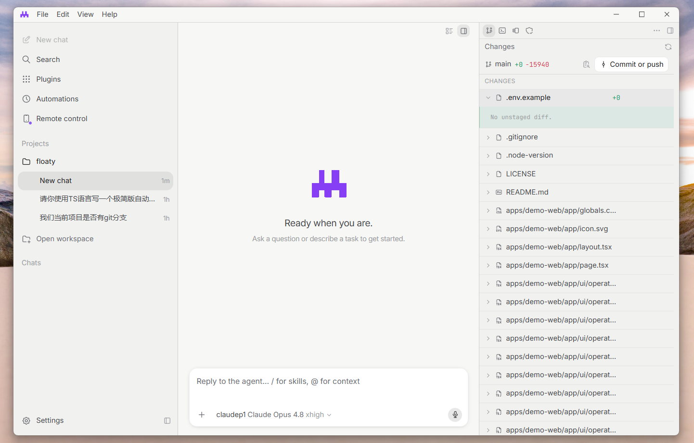

<div align="center">
  
  <h1>Modus</h1>
  <p><b>Local-first desktop workspace for AI coding agents.</b></p>
  <p>
    Open a project, chat with an agent, attach context, review diffs, run terminals, manage models,
    and keep the whole loop visible on your machine.
  </p>
</div>

<p align="center">
  
  
  
  
  
</p>

<p align="center">
  English | <a href="./README.zh-CN.md">简体中文</a>
</p>

<p align="center">
  
</p>

## Why Modus Exists

AI coding tools are getting powerful, but a lot of the workflow still feels hidden: where did the
agent run commands, which files changed, what context did it see, and what model is actually doing
the work?

Modus is an early desktop app that tries to make that loop visible and local:

- **One workspace, one real checkout**: sessions run in the selected project folder and current Git
  branch. Modus does not create hidden per-session Git worktrees or branches.
- **Agent work you can inspect**: chat, tool calls, Git changes, terminal output, permissions, and
  checkpoints live in the same window.
- **Bring your model stack**: configure PI-compatible providers, models, reasoning settings, custom
  providers, MCP servers, and local skills.
- **Built for hacking**: Electron + React + TypeScript + Rust sidecar, with a narrow typed preload
  bridge instead of renderer-side machine access.

Modus is not a mature Cursor or Codex replacement yet. It is a working local-first prototype with a
clear direction and a codebase you can study, modify, and grow.

> License note: this checkout does not yet include a license file. Add one before distributing
> packaged builds or treating the repo as legally reusable open source.

## Current Status

| Area | Status |
| --- | --- |
| Desktop shell | Working Electron app with custom titlebar, project sidebar, chat, and inspector |
| Workspaces | Open local folders, remember projects, detect Git repositories |
| Sessions | Local persisted chat sessions with streaming timeline events |
| Runtime | PI SDK agent runtime with model selection and per-session model updates |
| Context | `@` file, folder, Git diff, terminal output, image, and indexed Markdown doc context |
| Git | Change list, diffs, file versions, stage/unstage/discard, commit, push, status, stats |
| Review | Early AI review flow with stored review results and heuristic fallback checks |
| Terminal | Real PTY sessions through Rust `modus-pty-host`, rendered with xterm.js |
| Checkpoints | Pre-run snapshots, restore points, and rollback to previous user messages |
| Permissions | Typed IPC, sender validation, dynamic tool risk checks, and permission records |
| Models | Provider configuration, custom providers, model settings, context/output limits |
| MCP | Settings UI and preload/main services for MCP servers, tools, env placeholders, enable/disable |
| Skills | Local skill discovery/configuration surface for agent instructions |
| Layout polish | Single-session chat viewport with local horizontal scrolling for wide tables/code only |

## What It Feels Like

- The **left sidebar** is your project shelf: workspaces, sessions, activity, and archive controls.
- The **center** is the agent timeline: user messages, streamed assistant output, tool cards,
  diffs, terminal actions, todos, checkpoints, and rollback/edit affordances.
- The **composer** supports model switching, thinking-level config, images, slash skills, and `@`
  context.
- The **right inspector** holds Changes, Terminal, and Security so you can audit what happened while
  you are still in the conversation.
- The **settings window** manages providers, custom models, model parameters, MCP servers, skills,
  and security-facing configuration.

## Quick Start

### Requirements

- Node.js `>=22.19.0`
- npm
- Rust with Cargo
- Git
- PI-compatible model credentials/configuration for `@earendil-works/pi-coding-agent`

### Install

```bash
npm install
```

### Run

```bash
npm run dev
```

Then:

1. Open a workspace folder.
2. Configure a model provider in Settings if needed.
3. Start a chat.
4. Attach context with `@`, `/` skills, files, folders, images, Git diff, or terminal output.
5. Review changes in the inspector before committing or pushing.

### Build

```bash
npm --workspace @modus/desktop run build
```

This builds the Electron app and the Rust `modus-pty-host` terminal sidecar.

### Package On Windows

```bash
npm --workspace @modus/desktop run package:win -- --publish never
```

The packaging config includes the Rust terminal sidecar as an unpacked binary resource.

## Feature Details

### Agent Workflow

- Create and reopen local sessions.
- Stream agent events into a readable timeline.
- Edit and resend a previous user message.
- Roll back conversation state and workspace files to a checkpoint.
- Keep a visible changes strip above the composer.
- Run every session in the selected workspace checkout, not a generated worktree.

### Context And Knowledge

- Attach files and folders.
- Attach Git diffs.
- Attach terminal output.
- Attach images.
- Index Markdown docs from README/docs-style files.
- Search indexed docs from the context picker.

### Git And Review

- View changed files and full diffs.
- Read file versions.
- Stage, unstage, discard, and revert files.
- Commit or commit-and-push from the app.
- Run an early AI review pass over the current diff.
- Store review summaries and issues locally.

### Terminal

- Create user terminals in the inspector.
- Let the agent create managed terminals with `terminal_run`.
- Read, write to, list, and kill terminals through registered tools.
- Keep long-running commands visible instead of hiding them in an invisible subprocess.

### Models, MCP, And Skills

- Configure built-in and custom providers.
- Store provider/model configuration locally.
- Set model display names, context windows, output limits, temperature, top-p, and reasoning.
- Add MCP servers through a UI, including stdio and HTTP/SSE entries.
- Enable/disable MCP tools.
- Surface local skills and slash commands in the composer.

### Security Shape

- Renderer runs with no Node privileges.
- Capabilities go through a typed `window.modus` preload API.
- IPC validates payloads and sender windows.
- Dangerous shell/Git operations are classified before execution.
- Permissions are recorded locally.

See [desktop security notes](./docs/architecture/desktop-security.md) for more detail.

## What Is Intentionally Not In Scope Right Now

- Per-session Git worktree creation.
- Multi-agent tiled panes inside one workspace.
- Cloud agents.
- Browser/computer-use automation.
- Full PR automation.
- Auto-update, signing, and production release channels.

The current product direction is **multi-project, multi-session, current-checkout work**.

## Tech Stack

| Layer | Current implementation |
| --- | --- |
| Desktop | Electron 42, electron-vite |
| UI | React 19, Base UI, Tailwind CSS v4, Motion, Tabler Icons |
| Markdown | Streamdown, CJK, code, math, Mermaid |
| Terminal | xterm.js plus Rust `modus-pty-host` |
| Agent runtime | `@earendil-works/pi-coding-agent` PI SDK |
| Local data | Node `node:sqlite` |
| Diff and Git | Git CLI services |
| Validation | Zod, Typebox |
| Quality | TypeScript, Biome, Vitest |
| Packaging | electron-builder |

## Project Layout

```text
modus/
├─ apps/
│  ├─ desktop/              # Electron desktop app
│  └─ web/                  # Reserved workspace for a future web surface
├─ crates/
│  └─ pty-host/             # Rust PTY sidecar used by the terminal panel
├─ docs/
│  ├─ architecture/         # Architecture and security notes
│  └─ media/                # README logo and screenshots
├─ packages/                # Reserved workspace for shared packages
├─ MODUS_V0.1.0_EXECUTION_PLAN.md
└─ MODUS_V0.1.1_EXECUTION_PLAN.md
```

## Architecture In Plain English

```text
Renderer UI
  Sidebar, chat timeline, composer, settings, inspector, terminal, diff panel.

Preload bridge
  A narrow typed doorway called window.modus.

Electron main process
  Trusted services for workspace, Git, terminal, docs, model, MCP, skills, permissions, and agents.

Rust PTY sidecar
  Real terminal sessions without native terminal code inside React.

SQLite
  Local storage for workspaces, sessions, events, permissions, docs, reviews, checkpoints, and
  terminal output.
```

## Development Commands

```bash
npm run dev
npm run check
npm run format
npm run test
npm --workspace @modus/desktop run typecheck
npm --workspace @modus/desktop run build
npm --workspace @modus/desktop run package:win -- --publish never
cargo check -p modus-pty-host
```

## Comparison Context, June 2026

| Capability | Modus today | Codex App | Cursor 3.x+ |
| --- | --- | --- | --- |
| Product maturity | Early local prototype | Mature Codex desktop app | Mature agent-first IDE and Agents Window |
| Source openness | Open-source direction; license pending | Proprietary | Proprietary |
| Local project work | Working | Working | Working |
| Persistent chat sessions | Working | Working | Working |
| Current-checkout mode | Default | Local mode | Editor / workspace mode |
| Worktree mode | Intentionally removed | Optional Worktree mode | Worktree-oriented agent flows |
| Git diff/review | Working basics + early AI review | Strong review pane | Strong review and Bugbot flows |
| Terminal | Working PTY + agent terminal tools | Integrated terminal | Integrated terminal |
| MCP | Early UI/services | Supported | Supported |
| Skills/rules | Early skills surface | Skills/rules/memories vary by setup | Rules, memories, hooks, subagents |
| Cloud agents | Not implemented | Cloud mode | Cloud Agents |
| Browser/computer use | Not implemented | Browser/computer use features | Browser/design/remote flows |
| Automations | Not implemented | Automations | Cloud-agent automations |

Sources used for the product comparison:

- [Codex app features](https://developers.openai.com/codex/app/features)
- [Codex app review pane](https://developers.openai.com/codex/app/review)
- [Codex app in-app browser](https://developers.openai.com/codex/app/browser)
- [Codex app automations](https://developers.openai.com/codex/app/automations)
- [Codex Agent Skills](https://developers.openai.com/codex/skills)
- [Cursor Agents Window docs](https://cursor.com/docs/agent/agents-window)
- [Cursor Agent overview](https://cursor.com/docs/agent/overview)
- [Cursor terminal docs](https://cursor.com/docs/agent/tools/terminal)
- [Cursor browser docs](https://cursor.com/docs/agent/tools/browser)
- [Cursor MCP docs](https://cursor.com/docs/mcp)
- [Cursor Cloud Agents docs](https://cursor.com/docs/cloud-agent)
- [Cursor Automations docs](https://cursor.com/docs/cloud-agent/automations)
- [Cursor Bugbot docs](https://cursor.com/docs/bugbot)
- [Cursor permissions docs](https://cursor.com/docs/reference/permissions)

## Roadmap

Near-term:

- Sharper timeline rendering and fewer duplicate event edge cases.
- Stronger permission prompts and safer approval UX.
- Better diff review, hunk-level actions, and PR-oriented workflows.
- More reliable terminal replay and long-running command management.
- More complete MCP and skills experience.
- Packaging, signing, and release-channel hardening.

Later:

- Browser review.
- Rules and memories.
- Automations.
- Cloud or remote execution.
- Production-grade release pipeline.

## Contributing

There is no formal contribution guide yet. For now:

- Open an issue with a clear reproduction or proposal.
- Keep changes small and easy to review.
- Run `npm run check` and `npm run test` before sending a PR.
- Do not add hidden per-session worktree/parallel-agent behavior; current-checkout sessions are the
  product direction.

## License

No license file is present yet. Treat the repository as source-available for evaluation until a
license is added.
