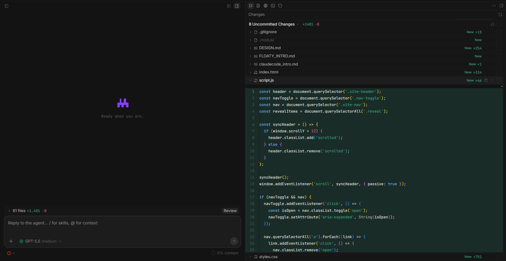

<div align="center">
  
  <h1>Modus</h1>
  <p><b>The open-source, local-first desktop workspace for AI coding agents.</b></p>
  <p>
    Plan a feature, let an agent build it, watch every command and diff, browse pages,
    run real terminals, and keep the whole loop on your machine.
  </p>

  <p>
    
    
    
    
    
    
  </p>

  <p>English | <a href="./README.zh-CN.md">简体中文</a></p>

  
</div>

Modus is a desktop app that makes agentic coding **visible and local**. You open a real
project folder, plan the work, and let an agent execute against your current checkout —
while chat, tool calls, Git changes, terminals, the browser, and permissions all live in
one window. Bring your own model stack (any PI-compatible provider, plus MCP servers and
local skills). Your code and history stay on your machine.

> **Run from source today** — packaged, signed installers for macOS / Windows / Linux are
> on the roadmap. The terminal sidecar is already cross-platform (`portable-pty`); the
> remaining work is the build/sign/release matrix.

## Quick Start

```bash
# Requirements: Node >= 22.19.0, npm, Rust + Cargo, Git
git clone https://github.com/brandlll-lee/modus.git
cd modus
npm install
npm run dev
```

Then:

1. **Open a workspace** folder (your real project + Git branch).
2. **Connect a model** provider in Settings (any PI-compatible provider, or a custom one).
3. **Plan, then build** — toggle Plan Mode to get a reviewable `plan.md`, approve it, and
   let the agent execute. Or just start chatting.
4. **Inspect everything** — review diffs, run terminals, open pages, and approve risky
   actions, all in the right inspector.

## Features

| Feature | What it does |
|---|---|
| **Plan Mode** | A read-only planning loop: the agent researches and asks clarifying questions, then writes a single reviewable `plan.md` instead of editing code. Approve it from the Review Plan card to start the build. |
| **Interactive Questions** | The `ask_user` tool lets the agent pause and ask structured questions (choice + free-text) so plans and turns stay aligned with your intent. |
| **Agent Timeline** | Streamed assistant output, tool cards, inline diffs, terminal actions, todos, and checkpoints — with edit-and-resend and rollback on any message. |
| **Per-turn execution** | Model, thinking level, and plan/build mode are bound to each turn, so switching mid-session (or rolling back) always runs with the settings you picked. |
| **Source Control** | Cursor-style Changes panel: scope switcher (Uncommitted / Unstaged / Staged / All commits), list ↔ tree layout, tri-state staging, per-file and whole-file diffs, commit history, and commit / push. |
| **Files** | An inspector file explorer with a resizable tree and smoothly collapsible folders, backed by a sandboxed read service. |
| **In-app Browser** | Real pages inside the inspector with tabs, navigation, DevTools, screenshots, and per-workspace storage isolation. The panel auto-opens when the agent starts browsing, and agents drive it with Cursor-compatible browser tools. |
| **Terminal** | Real PTY sessions through a Rust sidecar (`modus-pty-host`, `portable-pty`) rendered with xterm.js. Agents run managed, visible terminals via terminal tools. |
| **Context (`@`)** | Attach files, folders, Git diffs, terminal output, images, and indexed Markdown docs straight into the conversation. |
| **Models & Providers** | Configure built-in and custom PI-compatible providers, model parameters (context/output limits, temperature, reasoning), all stored locally. |
| **MCP & Skills** | Add MCP servers (stdio / HTTP-SSE) from a UI, enable/disable their tools, and surface local skills as slash commands. |
| **Permissions** | A typed preload bridge, IPC sender validation, dynamic risk classification of shell/Git/MCP actions, global approval modes, and local permission records. |
| **Checkpoints** | Pre-run snapshots and restore points let you roll the workspace back to any earlier message. |

## What It Feels Like

- The **left sidebar** is your project shelf: pinned and recent projects (each with a
  "..." actions menu), sessions, and live activity.
- The **center** is the agent timeline: messages, streamed output, tool cards, diffs,
  terminal actions, todos, checkpoints, and the Review Plan / Questions cards above the
  composer.
- The **composer** switches model and thinking level, sets the approval mode, toggles
  Plan vs Build, and takes images, `/` skills, and `@` context.
- The **right inspector** holds Changes, Files, Browser, Terminal, and Security, so you can
  inspect diffs, pages, logs, and runtime state without leaving the conversation.
- The **settings window** manages providers, custom models, model parameters, MCP servers,
  skills, and security configuration.

## Architecture

```text
Renderer (React 19)        Sidebar · chat timeline · composer · inspector
        │                  (Changes / Files / Browser / Terminal / Security) · settings
        ▼
Preload bridge             A narrow, typed doorway: window.modus.*  (no Node in the renderer)
        │
        ▼
Electron main (Node)       Trusted services: workspace · git · browser (CDP) · terminal ·
        │                  files · docs · models · MCP · skills · permissions · agent runtime
        ├──────────────►   Rust PTY sidecar (modus-pty-host)   real terminals via portable-pty
        └──────────────►   SQLite (node:sqlite)                workspaces, sessions, events,
                                                               permissions, docs, checkpoints
```

Design principles: authoritative signals over heuristics, capability-driven rendering over
name-based dispatch, and a renderer that can only reach the system through validated IPC.
See [desktop security notes](./docs/architecture/desktop-security.md).

## Tech Stack

| Layer | Implementation |
|---|---|
| Desktop | Electron 42, electron-vite |
| UI | React 19, Base UI, Tailwind CSS v4, Motion, Tabler Icons |
| Editors | Monaco (diff + code), xterm.js (terminal) |
| Markdown | Streamdown (+ CJK, code, math, Mermaid) |
| Agent runtime | `@earendil-works/pi-coding-agent` (PI SDK) |
| Terminal sidecar | Rust + `portable-pty` (`crates/pty-host`) |
| Local data | `node:sqlite` |
| Validation / quality | Zod, Typebox · TypeScript, Biome, Vitest |
| Packaging | electron-builder |

## Project Layout

```text
modus/
├─ apps/
│  └─ desktop/            # Electron app (main · preload · renderer)
├─ crates/
│  └─ pty-host/           # Rust PTY sidecar used by the terminal
├─ docs/                  # Architecture and media
└─ packages/              # Reserved for shared packages
```

## Development

```bash
npm run dev          # run the desktop app
npm run check        # biome + typecheck across the workspace
npm run format       # biome --write
npm run test         # vitest (unit + integration)

# desktop-only
npm --workspace @modus/desktop run typecheck
npm --workspace @modus/desktop run build      # builds the app + Rust sidecar
cargo check -p modus-pty-host
```

Tests use real execution (real git repos, real PTY) rather than mocks, and assert behavior
contracts instead of pinning sample data.

## Roadmap

**Near-term**
- Cross-platform release matrix: build the Rust sidecar per target, bundle it into each
  installer, and sign / notarize (macOS, Windows).
- Sharper timeline rendering and stronger approval UX.
- Hunk-level staging and richer review flows.

**Later**
- Fusion mode: plan → isolated worktrees → parallel agents → judge → integrator.
- Rules, memories, and automations.

## Contributing

There is no formal contribution guide yet. For now:

- Open an issue with a clear reproduction or proposal.
- Keep changes small, scoped, and easy to review (Conventional Commits).
- Run `npm run check` and `npm run test` before sending a PR.
- Favor systematic, root-cause solutions over patches: authoritative signals over guessing,
  data/config over name-lists and magic numbers, and no dead or faked UI.

## License

No license file is present yet. Treat the repository as source-available for evaluation
until a license is added.
