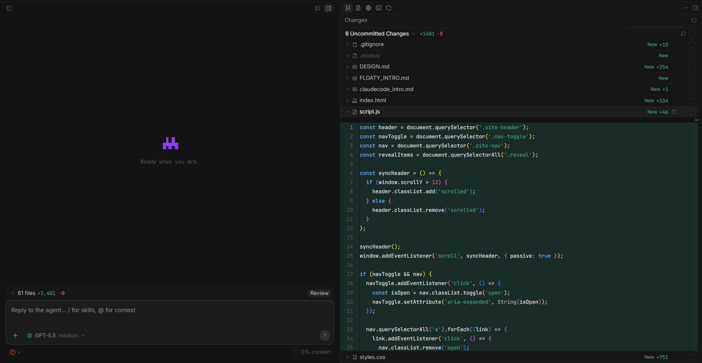

<p align="center">
  <a href="./README.md">English</a> | 简体中文
</p>

<p align="center">
  
</p>

<h1 align="center">Modus</h1>

<p align="center">
  本地优先的 AI 编码 Agent 桌面工作区。
</p>

<p align="center">
  <a href="#快速开始">快速开始</a> ·
  <a href="#核心功能">核心功能</a> ·
  <a href="./docs/architecture/desktop-security.md">安全说明</a>
</p>



## 关于

Modus 是一个开源桌面应用，用来让 AI 编码 Agent 在真实的本地项目里工作。

打开项目，复用 PI 的模型配置，在桌面界面中进行对话和查看项目。

Modus 还很早期，目前推荐从源码运行。

## 核心功能

- **Workspace 和 Session** - 打开本地项目，切换最近 workspace，置顶项目，并按仓库保留独立 Agent 会话。
- **自带模型接入** - 配置内置或自定义 PI 兼容 provider、默认模型、reasoning、thinking variant 和模型限制。
- **Git 工作流** - 查看工作区改动、文件 diff、分支、提交历史、commit、push 和改动统计。
- **Terminal、Browser 和 Files** - 使用真实 PTY 终端、带 tab 和 DevTools 的内置浏览器，以及 workspace 文件浏览器。
- **文件和图片** - 选择本地路径，在发送给 PI 前预览图片。
- **MCP、Skills 和扩展** - 复用 PI 的资源发现、项目信任和扩展命令。

## 快速开始

Windows 和 macOS 都需要：

- Node.js `>= 22.19.0`
- npm
- Rust + Cargo
- Git

```bash
git clone https://github.com/brandlll-lee/modus.git
cd modus
npm install
npm run dev
```

然后打开一个 workspace 文件夹，并在 Settings 里配置模型 provider。

## 开发

```bash
npm run dev
npm run check
npm run test
npm --workspace @modus/desktop run typecheck
npm --workspace @modus/desktop run build
```

本地打包：

```bash
npm --workspace @modus/desktop run package:win -- --publish never
npm --workspace @modus/desktop run package:mac -- --publish never
```

Windows 运行 Windows 命令，macOS 运行 macOS 命令。

## MCP 配置

Modus 只会自动读取自己的 MCP 配置：

```text
~/.modus/mcp.json
<workspace>/.modus/mcp.json
```

它不会静默导入 Cursor、Claude、Warp 或其它 Agent 工具的配置。

## 技术栈

Electron、React、TypeScript、Tailwind CSS、Base UI、Motion、Monaco、xterm.js、Streamdown、Node SQLite、Rust `portable-pty`、`@earendil-works/pi-coding-agent` 和 MCP SDK。

## 贡献

欢迎贡献。请保持 PR 小而清晰，使用 Conventional Commits，并在提交前运行 `npm run check` 和 `npm run test`。

## License

Apache-2.0。见 [LICENSE](./LICENSE)。
